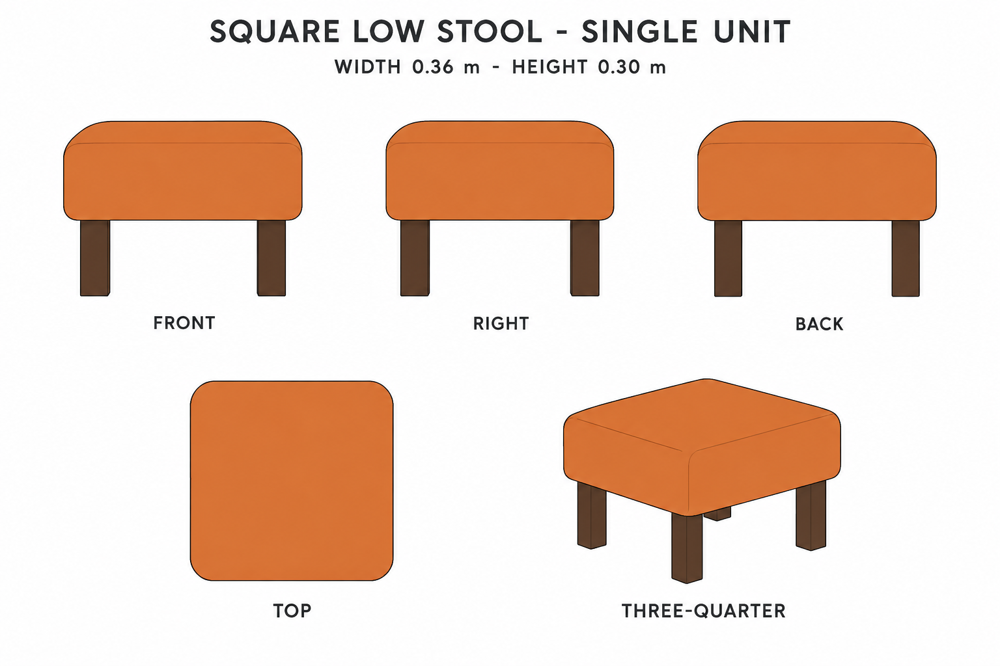
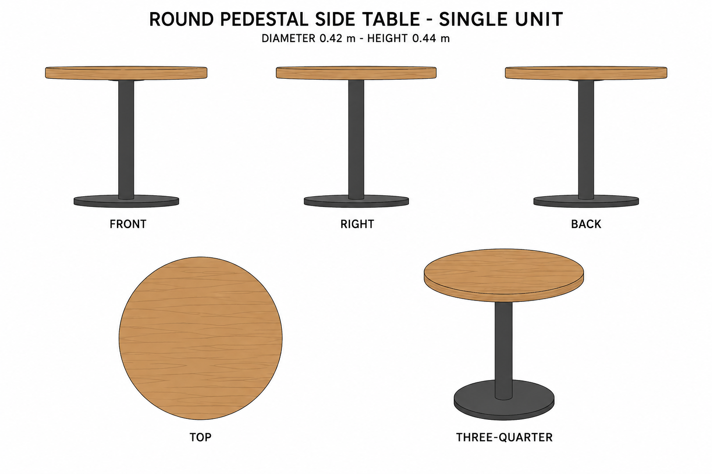

# Group 4O - Accent Furniture Review

Status: approved for commit by the user. Drawings and specifications only; no model verification.

## Orange square low stool

## Round pedestal side table

Both units have front, right, back, top and oblique views. Review colour, silhouette and reference match. Hidden supports, four-leg count and circular table base are authored completions, not exact measurements from the source.

Use the [geometry supplement](../GEOMETRY-SUPPLEMENT.md), [JSON](../accent-furniture-model-spec.json) and [surface recipes](../SURFACE-RECIPES.md) for reconstruction. Generated front views are slightly elevated and pixel proportions are not dimensional authority. The stool's drawn top contour is not a seam. No lighting marks should become textures.
