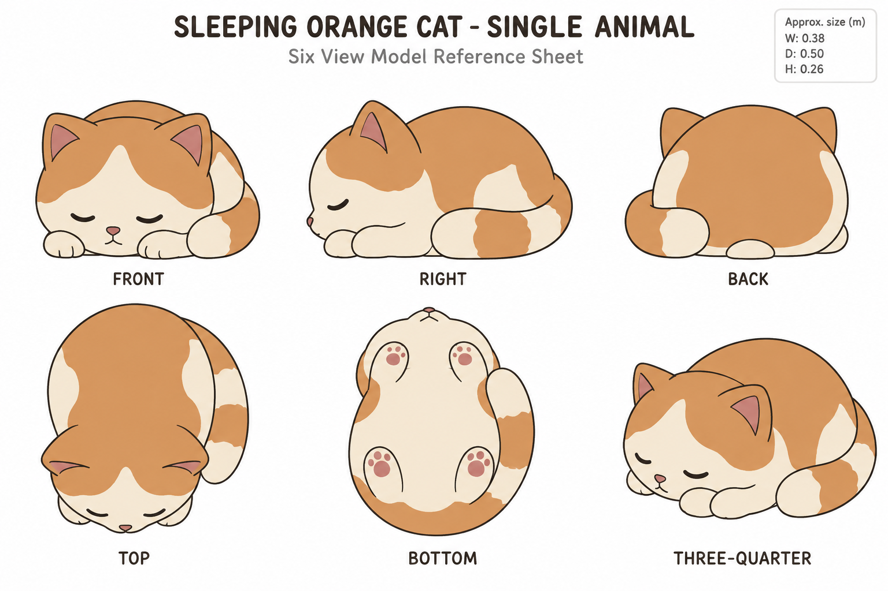
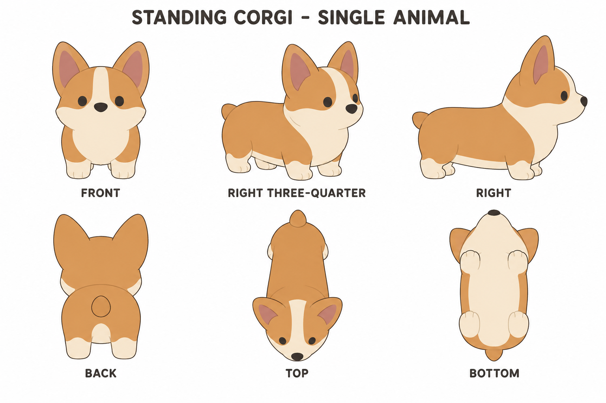

# Group 3B - Animal Review Gallery

Status: user-approved reference sheets. Two complete independent animals.

## Sleeping orange cat

The central-office pet, in a curled sleeping pose. Authored bounds: 0.38 x 0.50 x 0.26 m.

## Standing corgi

The exterior dog, standardized to a four-paw standing pose. Authored bounds: 0.32 x 0.62 x 0.48 m.

## Review scope

Confirm likeness to the source, chibi proportions, sleeping/standing poses, ear shapes, tail placement and orange/cream coat regions. Undersides and obscured details are authored completions. No floor, rug, collar, prop or cast shadow is included.

- [Geometry and hidden anatomy](../GEOMETRY-SUPPLEMENT.md)
- [Material and facial recipes](../SURFACE-RECIPES.md)
- [Numeric specification](../animals-model-spec.json)
- [Actual prompts](PROMPTS.md)

No models, rigging, animation or app changes are included. These drawings are not calibrated projections; future model comparison remains necessary. Sparrow and parrot are not part of this batch.
