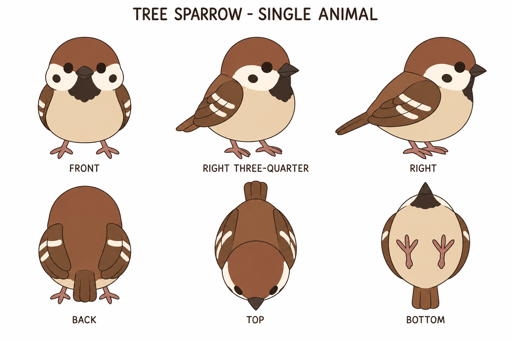
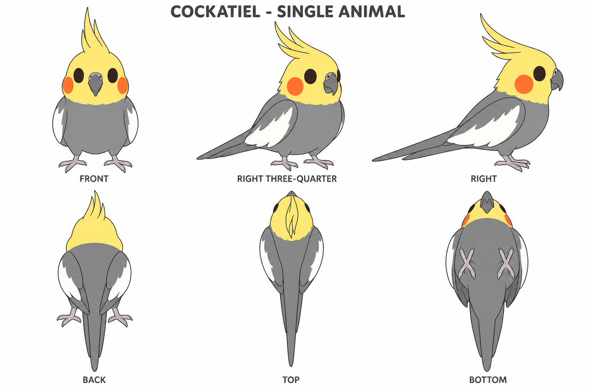

# Group 3C - Bird Review Gallery

Status: user-approved reference sheets.

## Tree sparrow

One round chestnut-and-tan bird with folded wings. Each foot has three forward toes and one rear toe. Final authored bounds: 0.160 x 0.230 x 0.200 m.

## Cockatiel

One gray cockatiel with a yellow head and crest, orange cheeks, hooked beak, white wing patches and long tapered tail. Each foot has two forward toes and two rear toes. Final authored bounds: 0.180 x 0.360 x 0.320 m.

## Review scope

Review silhouette, chibi proportions, colors, folded wings, tail length, beaks and feet. These are newly authored companions, not animals recovered from the reference image. No shadows or props are part of either asset.

- [Geometry supplement](../GEOMETRY-SUPPLEMENT.md)
- [Surface recipes](../SURFACE-RECIPES.md)
- [Numeric specification](../birds-model-spec.json)
- [Prompts](PROMPTS.md)

Images are appearance proposals, not calibrated engineering projections or proof of a completed 3D reconstruction. The user approved these two reference sheets for commit.
