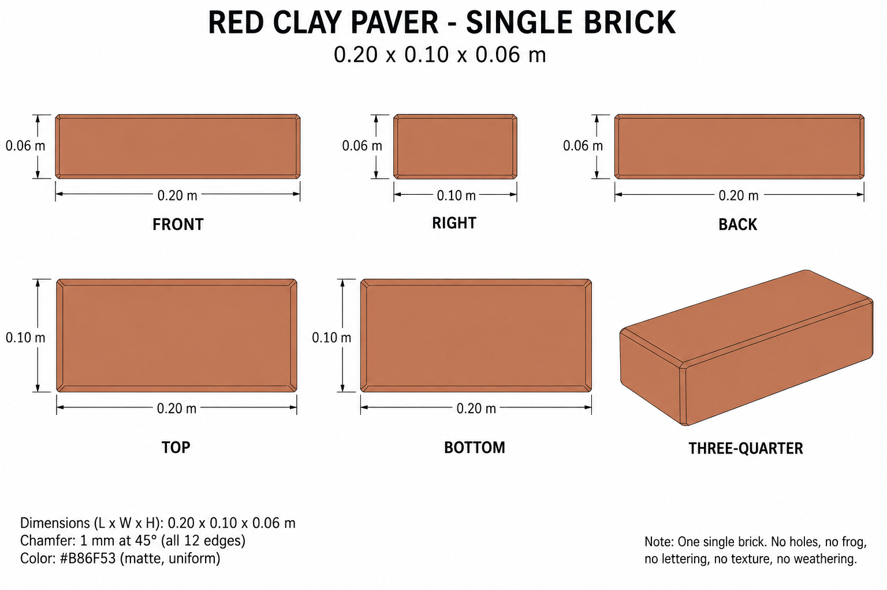

# Group 2C - Review Gallery

Status: user-approved reference sheets.

## Single red clay paver

One independent brick, 0.20 x 0.10 x 0.06 m, with one-millimetre straight chamfers.

## Review scope

Confirm the warm terracotta color, simple solid form and single-unit boundary. There is no road paint, asphalt, mortar, surrounding paving or ground shadow. This is a supplementary design rather than a copy of an identifiable original-image brick.

The drawing is not a calibrated projection. Chamfer contours are illustrative; exact reconstruction uses the documented vertex construction and dimensions.

- [Geometry and placement reference](../GEOMETRY-SUPPLEMENT.md)
- [Surface recipes](../SURFACE-RECIPES.md)
- [Numeric specification](../clay-paving-model-spec.json)
- [Actual prompt](PROMPTS.md)

No model or app implementation is included. Model verification remains a later stage.
