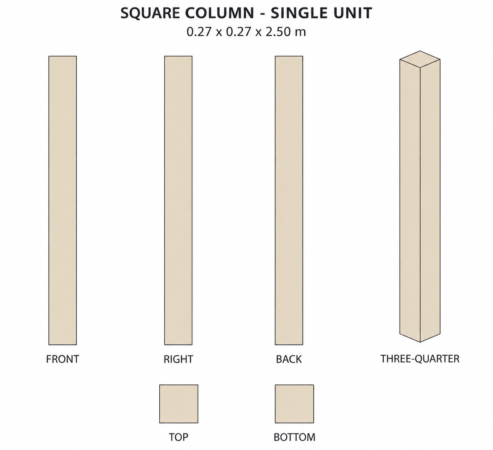
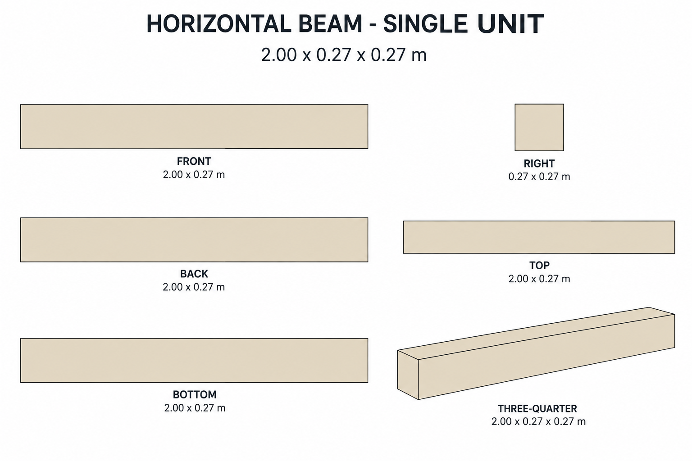

# Group 1C - Review Gallery

Status: user-approved reference sheets. Each sheet shows one independent placeable unit from multiple angles.

## Square column

0.27 x 0.27 x 2.50 m. Plain square cross-section, with closed flat top and bottom.

## Horizontal beam

2.00 x 0.27 x 0.27 m. Plain rectangular solid with square ends.

## Review scope

These are supplementary cream architectural modules. Confirm silhouette, color and single-unit boundaries. There is no attached ground, roof, wall or furnishing and no ground shadow. Views are appearance references, not calibrated CAD projections. Use numerical geometry for all dimensions and hidden surfaces.

- [Geometry and placement reference](../GEOMETRY-SUPPLEMENT.md)
- [Surface recipes](../SURFACE-RECIPES.md)
- [Numeric specification](../column-beam-model-spec.json)
- [Actual prompts](PROMPTS.md)

No models, Blender validation or app implementation is included. Approved for the reference handoff; model verification remains a future stage.
