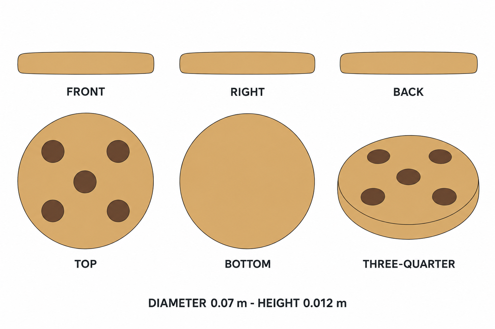

# Group 4AD - Review Gallery

Status: user-approved reference sheets.

## One chocolate chip cookie

Diameter 0.070 m, height 0.012 m. Five circular chocolate-colored spots are flush with the flat top. Rounded rim and plain bottom.

## Review scope

Confirm the simple round form, five spots and single-unit boundary. No plate, package, crumbs or ground shadow is included. The selected revision removes the initial rim highlight and face shading.

- [Geometry and spot positions](../GEOMETRY-SUPPLEMENT.md)
- [Surface recipes](../SURFACE-RECIPES.md)
- [Numeric specification](../cookie-model-spec.json)
- [Generation and correction prompts](PROMPTS.md)

This is a supplementary snack design. Images are appearance references, not calibrated projections. No model or app implementation is included.
