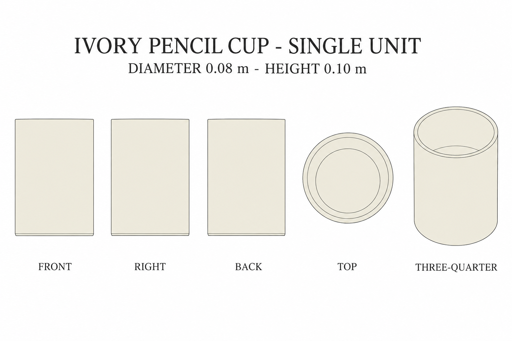
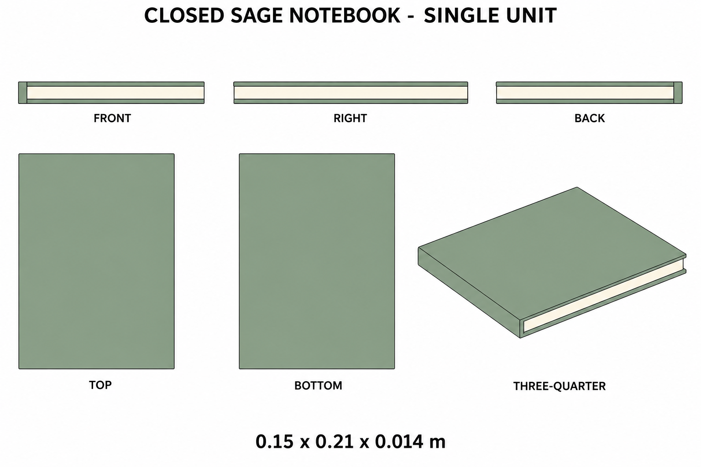

# Group 4AA Review - Pencil Cup and Notebook

Status: user-approved reference sheets.

## Empty ivory pencil cup

One hollow unit, diameter 0.080 m, height 0.100 m. No handle or included stationery.

## Closed sage notebook

One closed unit, 0.150 x 0.210 x 0.014 m. Sage covers and spine, plain ivory page block. No printing or accessories.

## Review scope

Both are supplementary designs. Review silhouette, color, proportions and unit boundaries. [Geometry](../GEOMETRY-SUPPLEMENT.md), [numeric specification](../desktop-stationery-model-spec.json), and [surface recipes](../SURFACE-RECIPES.md) define hidden construction.

No baked lighting, model output or app implementation. Approved for this reference handoff.
