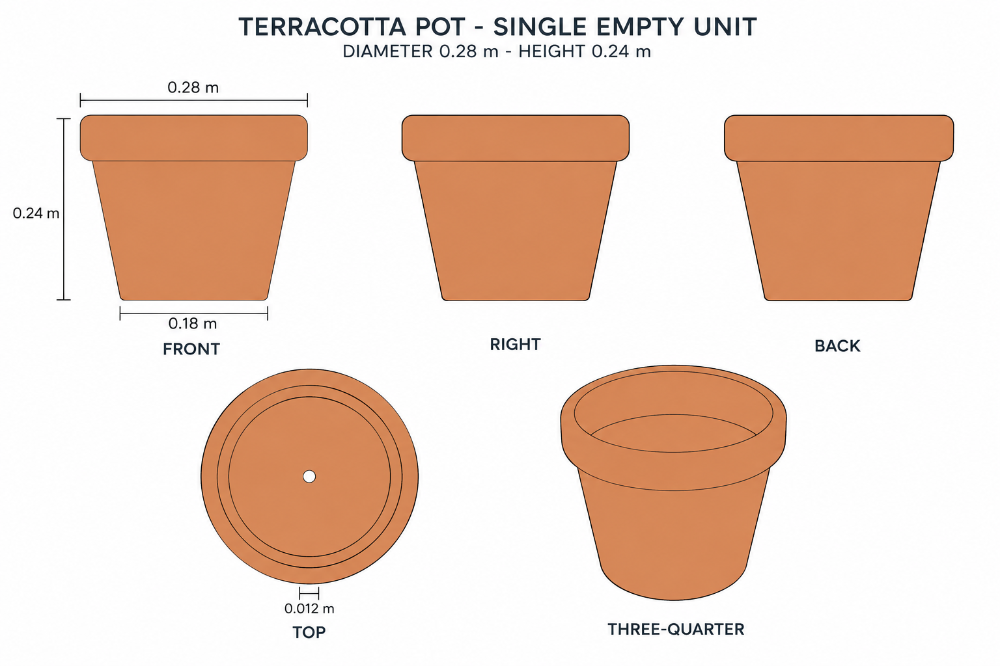
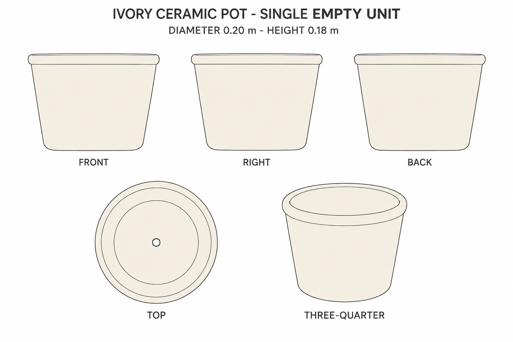

# Group 5C - Empty Pots Review

Status: approved for commit by the user. Drawings and specifications only; no model verification.

## Empty terracotta pot

## Empty ivory ceramic pot

Each sheet shows front, right, back, top and oblique views of one container. Review shape, colour and suitability as an independently placeable empty pot. Contents and saucers are excluded.

Use the [geometry supplement](../GEOMETRY-SUPPLEMENT.md), [JSON](../empty-pots-model-spec.json) and [surface recipes](../SURFACE-RECIPES.md). Exact hollow profiles and drain construction are authored completions, not details recovered from the obscured reference. Generated views are not calibrated projections. The drain may be hidden in an oblique view but remains centred in the model specification.
