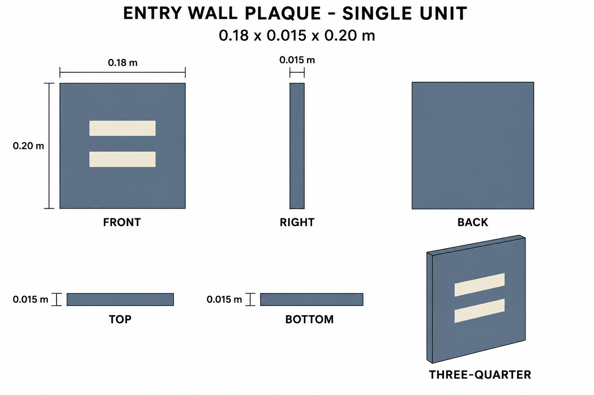

# Group 4AG - Review Gallery

Status: user-approved reference sheets.

## Entry wall plaque

One blue-gray plate, 0.18 x 0.015 x 0.20 m, with two flush ivory front bars.

## Review scope

Confirm the plain plate shape, color family and simplified pale markings. The source's lettering is unreadable; the two bars are authored design choices requiring review. They are not an exact transcription.

No wall, door, mounting hardware or ground shadow is included. The back and edges are plain. Exact dimensions come from the numerical specification.

- [Geometry and mounting reference](../GEOMETRY-SUPPLEMENT.md)
- [Surface recipes](../SURFACE-RECIPES.md)
- [Numeric specification](../entry-plaque-model-spec.json)
- [Actual prompt](PROMPTS.md)

No model or app implementation is included. Reconstruction verification remains a future stage.
