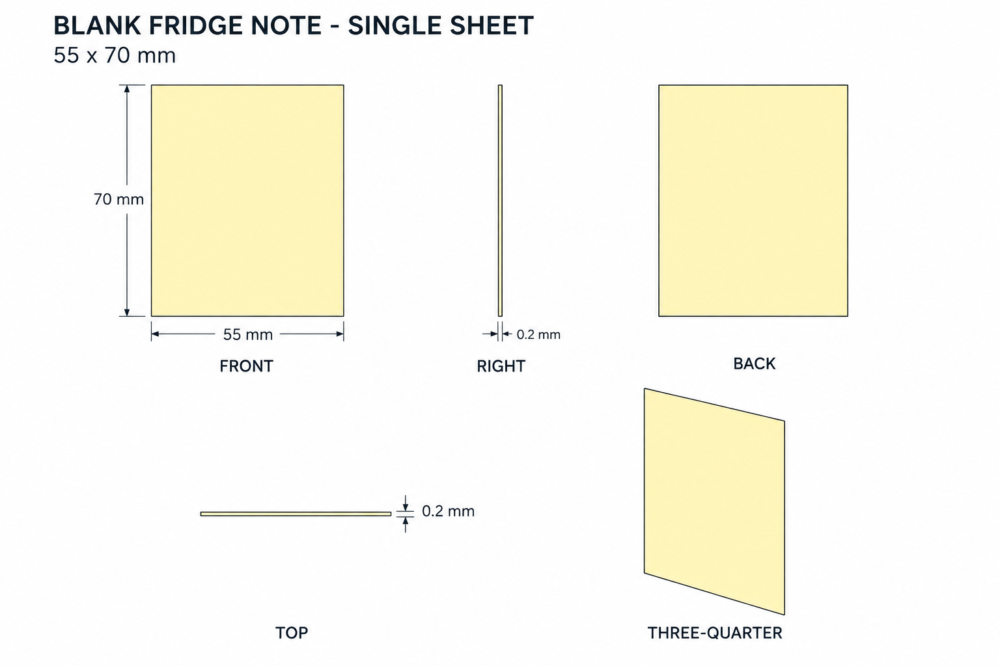
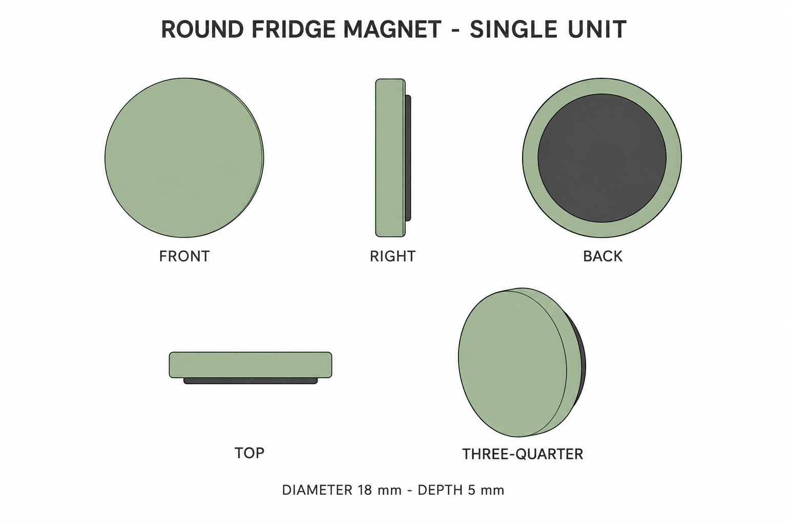

# Group 4Q - Fridge Accessories Review

Status: approved by the user for commit; no models.

## Blank note

## Complete round magnet

Each sheet has front, right, back, top and oblique views. Review colour, silhouette and independent unit boundaries. Paper remains blank because source text is unreadable. Magnet colour and backing are authored completions of tiny source details.

See [geometry](../GEOMETRY-SUPPLEMENT.md), [JSON](../fridge-accessories-model-spec.json) and [surfaces](../SURFACE-RECIPES.md). Note edge thickness is exaggerated in the drawing; numerical thickness is authoritative. The selected magnet has a 0.8 mm projecting backing, included within its 5 mm total depth.
