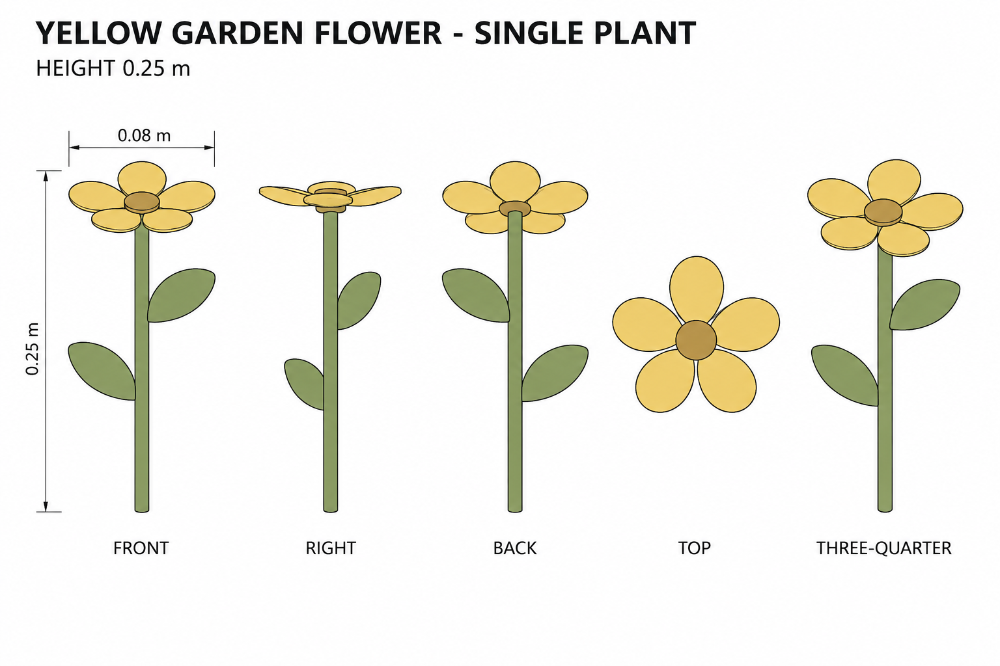
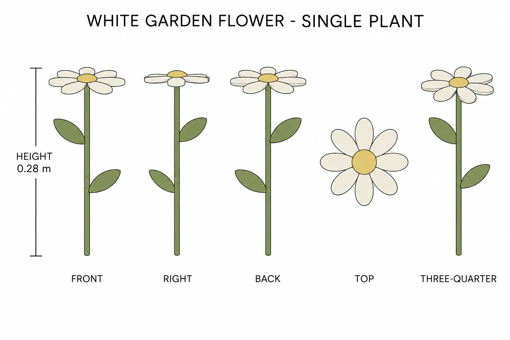

# Group 5E Review - Garden Flowers

Status: user-approved reference sheets.

## Yellow garden flower

One plant, height 0.250 m. Five yellow petals, ochre center, one stem and two leaves.

## White garden flower

One plant, height 0.280 m. Eight ivory petals, yellow center, one stem and two leaves.

## Review scope

These use source-garden color cues with authored simplified geometry. Review silhouettes, palette, petal arrangement and independent unit boundaries. No pot, soil or ground.

[Geometry](../GEOMETRY-SUPPLEMENT.md), [numeric specification](../garden-flowers-model-spec.json), and [surface recipes](../SURFACE-RECIPES.md) define hidden construction. No baked lighting, model output, animation or app implementation. Approved for this reference handoff.

TOP is a flower-head detail with lower leaves omitted; elevations are illustrative rather than calibrated orthographic projections. Use numerical leaf positions and horizontal flower-head orientation for reconstruction.
