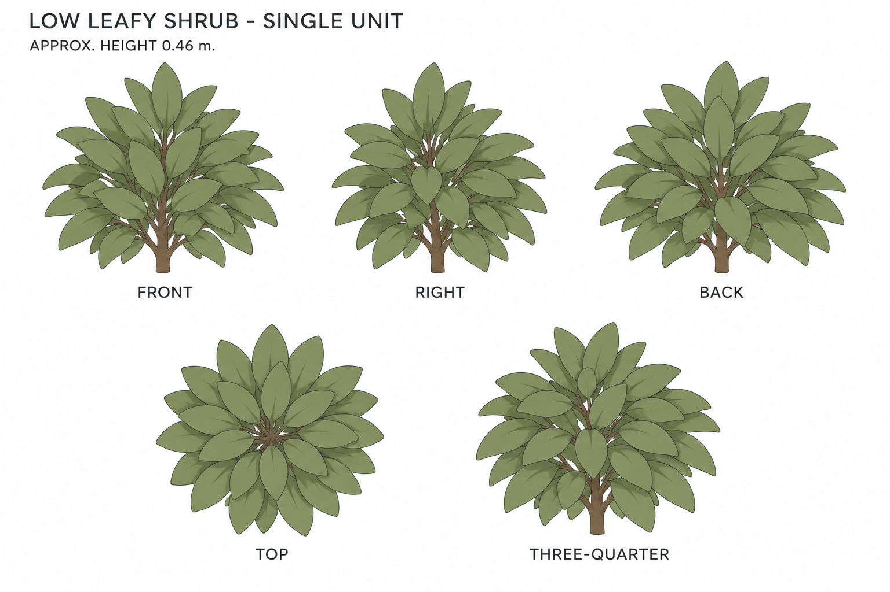
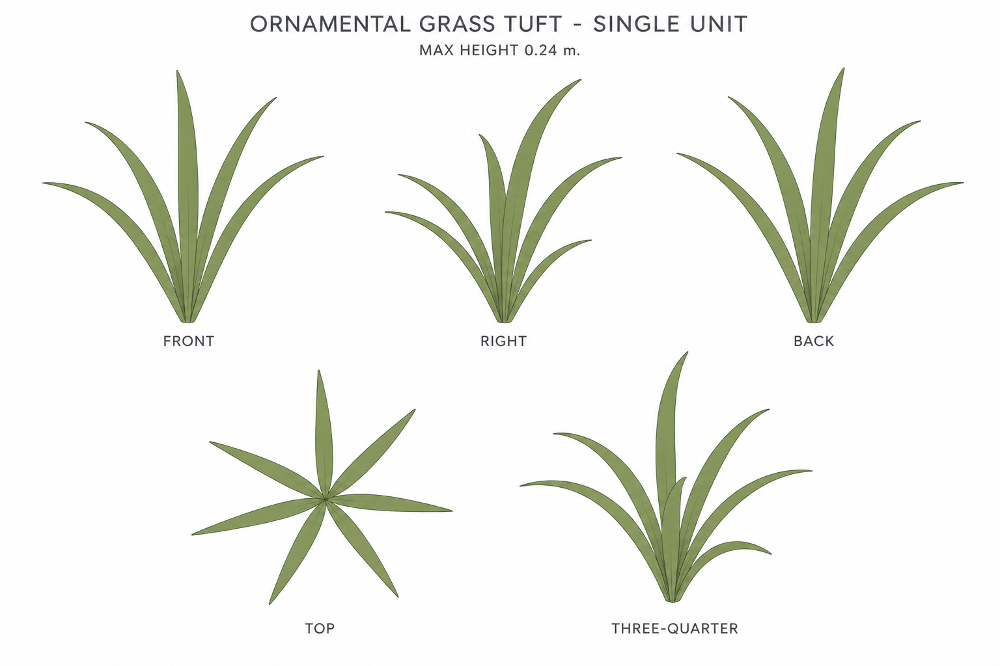

# Group 5D Review - Shrub and Grass Tuft

Status: user-approved reference sheets.

## Low leafy shrub

One plant with compact olive foliage, authored height 0.460 m. No pot, soil, flowers, or ground.

## Ornamental grass tuft

One tuft of seven outward-curving blades, maximum height 0.240 m. No underlying disk or surrounding grass patch.

## Review scope

The original garden supplies style and color cues. Individual geometry is a simplified authored completion. Review silhouette, density, color, and unit boundaries; the [geometry supplement](../GEOMETRY-SUPPLEMENT.md), [numeric specification](../garden-greenery-model-spec.json), and [surface recipes](../SURFACE-RECIPES.md) define construction.

Drawings are not leaf-by-leaf calibrated projections. No baked lighting, model output, animation, or app implementation. Approved for this reference handoff.
