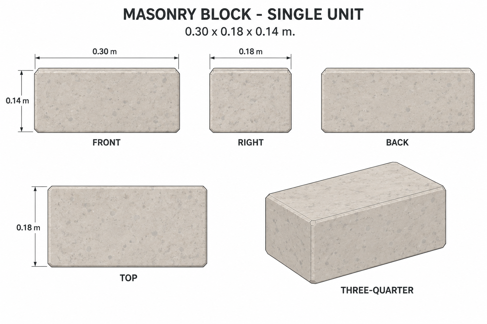
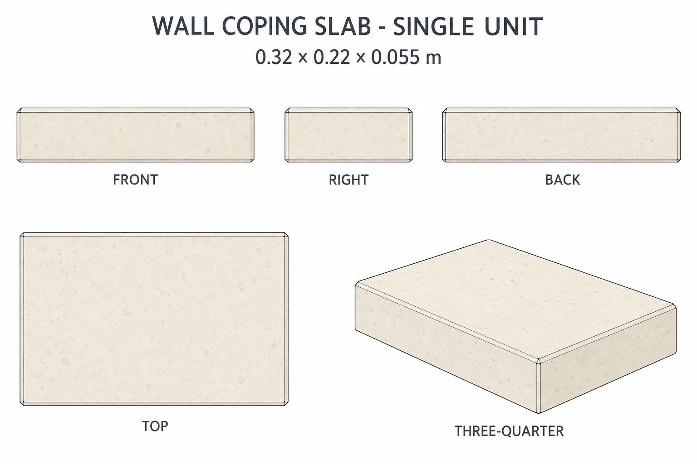

# Group 2B - Garden Masonry Review

Status: approved for commit by the user. Drawings and specifications only; no model verification.

## One masonry block

## One coping slab

Each image shows front, right, back, top and oblique views of one stone. Review colour, proportions and the reference's restrained masonry appearance. No mortar or preset arrangement is included.

Use the [geometry supplement](../GEOMETRY-SUPPLEMENT.md), [JSON](../garden-masonry-model-spec.json) and [surface recipes](../SURFACE-RECIPES.md) for exact reconstruction inputs. Dimensions and hidden surfaces are authored completions. Generated views and speckle locations are illustrative, not calibrated measurements or production texture maps.
