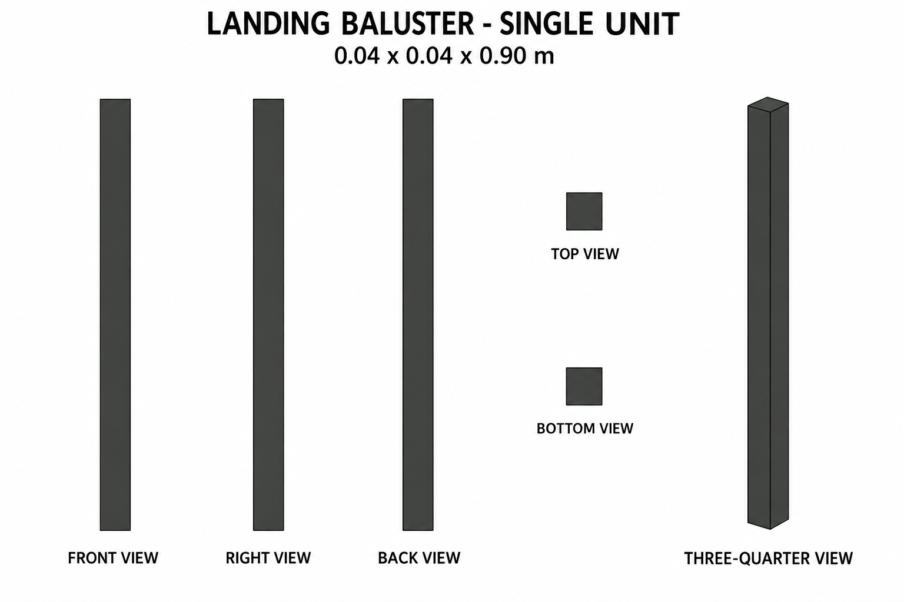
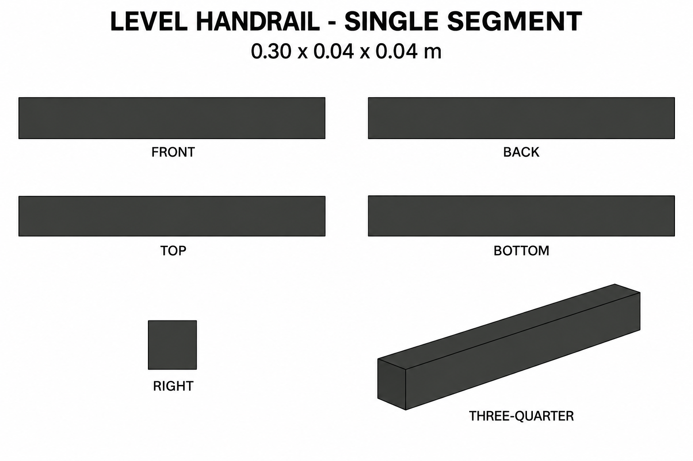

# Group 1E - Review Gallery

Status: user-approved reference sheets. Two supplementary independent parts for straight level railing runs.

## Landing baluster

One plain flat-top post: 0.04 x 0.04 x 0.90 m.

## Level handrail

One horizontal segment: 0.30 x 0.04 x 0.04 m.

## Review scope

Confirm the flat top, level rail, charcoal palette and single-unit boundaries. No stairs, floor, attached posts or ground shadows are included. These are appearance sheets; exact reconstruction uses the documented bounds.

- [Geometry and connection reference](../GEOMETRY-SUPPLEMENT.md)
- [Surface recipes](../SURFACE-RECIPES.md)
- [Numeric specification](../landing-railing-model-spec.json)
- [Actual prompts](PROMPTS.md)

The stair-to-platform transition joint is not part of this batch. No models or app implementation are included; reconstruction validation remains a future stage.
