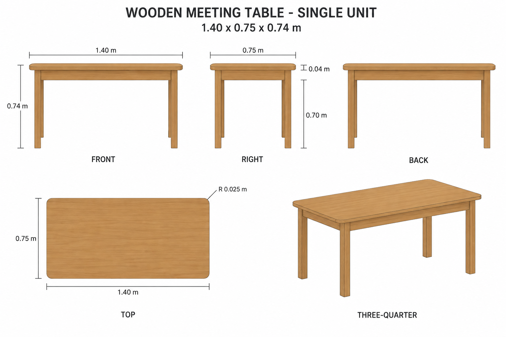
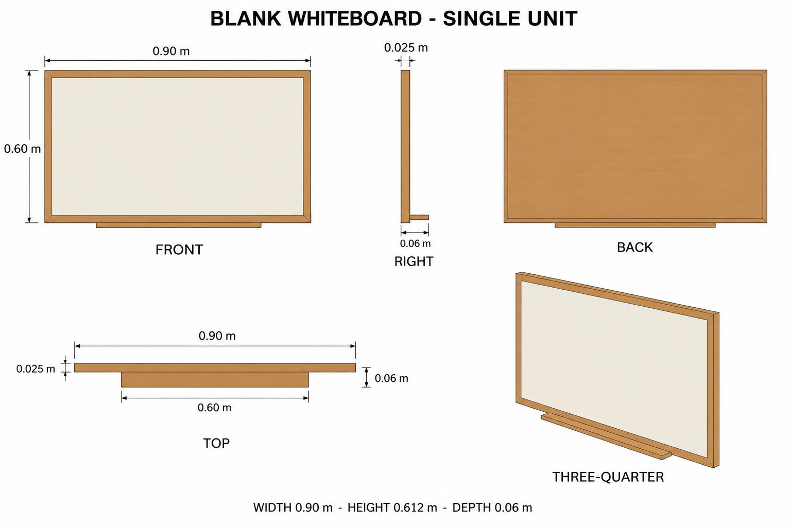

# Group 4X Review - Meeting Table and Whiteboard

Status: user-approved reference sheets.

## Wooden meeting table

One table, 1.400 x 0.750 x 0.740 m. Four straight wooden legs and four under-table aprons. No attached chairs or desk items.

## Blank whiteboard

One wall-mounted assembly, 0.900 x 0.612 x 0.060 m including tray. The frame is 0.600 m high. No writing or included stationery.

## Review scope

The table uses broad source-thumbnail cues; hidden construction is authored. The whiteboard is a supplementary design. Review silhouette, palette, proportions, and unit boundaries.

[Geometry](../GEOMETRY-SUPPLEMENT.md), [numeric specification](../meeting-furniture-model-spec.json), and [surface recipes](../SURFACE-RECIPES.md) define the handoff. Drawings are illustrative; no model or app behavior is verified. No baked lighting. Approved for this reference handoff.
