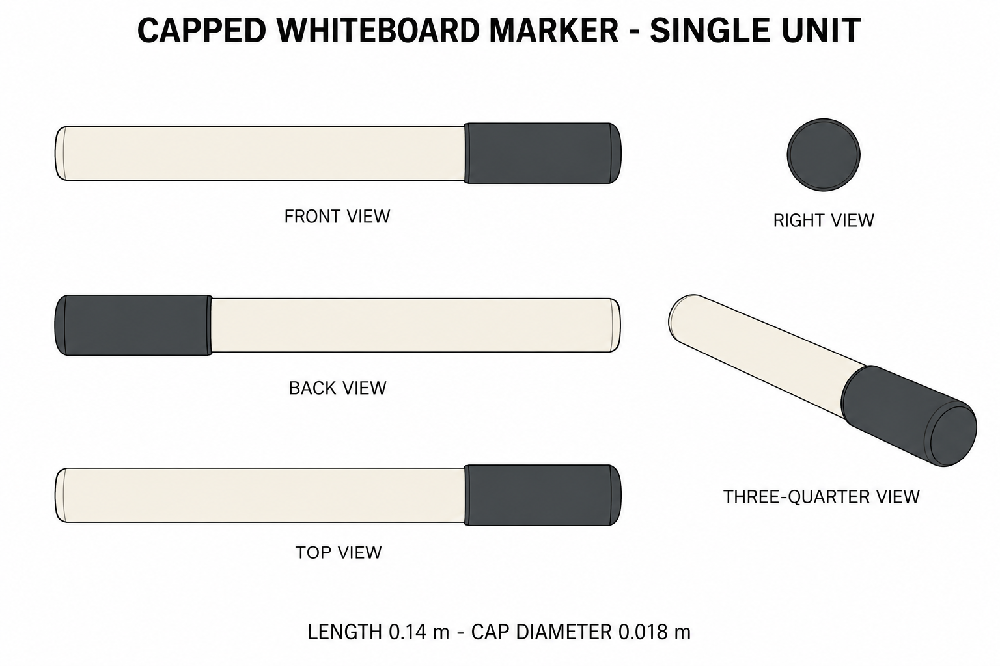
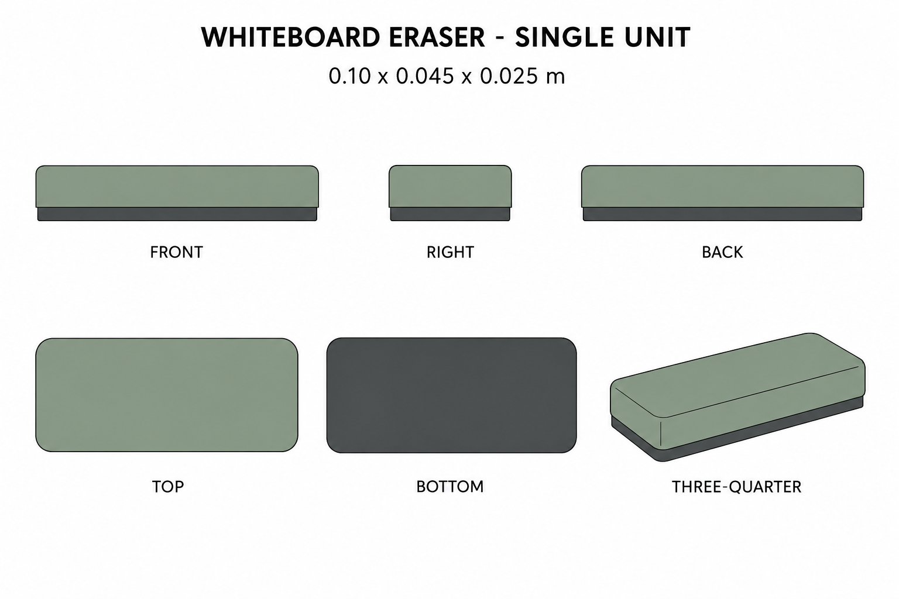

# Group 4Y Review - Whiteboard Marker and Eraser

Status: user-approved reference sheets.

## Capped whiteboard marker

One capped unit, 0.140 m long, cap diameter 0.018 m. No clip or printed label. Hidden neck, nib, and cap bore are specified separately; an uncapped state is not pictured.

## Whiteboard eraser

One independent unit, 0.100 x 0.045 x 0.025 m. Sage grip above one charcoal felt pad. Bottom detail shows the contact surface.

## Review scope

These are supplementary designs. Review silhouette, palette, part counts, and independent placement boundaries. [Geometry](../GEOMETRY-SUPPLEMENT.md), [numeric specification](../meeting-stationery-model-spec.json), and [surface recipes](../SURFACE-RECIPES.md) define reconstruction decisions.

No shadows baked into materials, models, or app implementation. Approved for this reference handoff.
