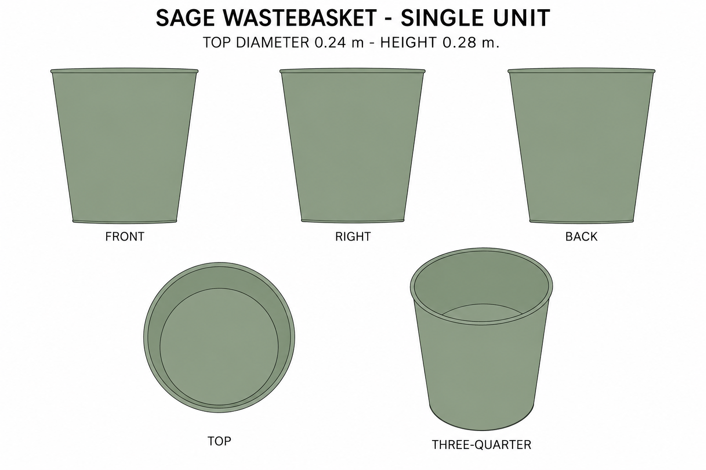
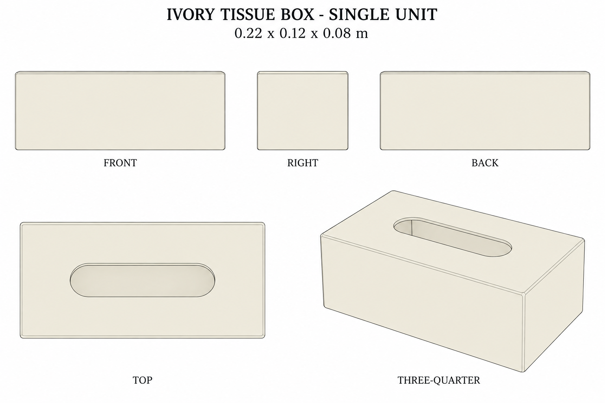

# Group 4W Review - Office Containers

Status: user-approved reference sheets.

## Sage wastebasket

One empty unit. Top diameter 0.240 m, bottom diameter 0.180 m, height 0.280 m. Thin tapered walls and closed flat bottom. No liner, lid, or contents.

## Ivory tissue box

One empty shell, 0.220 x 0.120 x 0.080 m. Centered capsule opening, softened outside edges, no attached paper.

## Review scope

Both are supplementary designs matching the existing palette. Review appearance, proportions and unit boundaries. [Geometry](../GEOMETRY-SUPPLEMENT.md), [numeric specification](../office-containers-model-spec.json) and [surface recipes](../SURFACE-RECIPES.md) define dimensions and hidden construction.

No baked lighting, models, or app implementation. Approved for this reference handoff.
