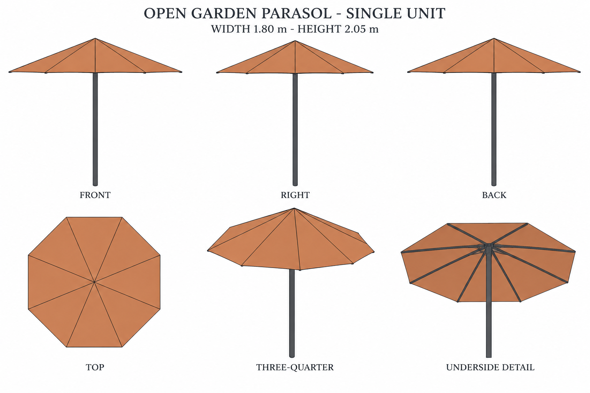
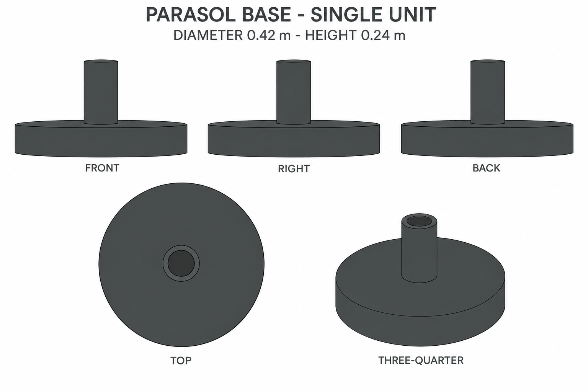

# Group 4AC Review - Garden Parasol and Base

Status: user-approved reference sheets.

## Open garden parasol

One assembly without a base. Octagonal canopy, 1.800 m across opposite vertices, total height 2.050 m. Static open state.

## Parasol base

One separate unit, diameter 0.420 m and height 0.240 m. Real socket bore diameter 0.037 m; no pole included.

## Review scope

These are supplementary designs. Review silhouette, palette, panel/support arrangement and independent unit boundaries. [Geometry](../GEOMETRY-SUPPLEMENT.md), [numeric specification](../outdoor-shade-model-spec.json), and [surface recipes](../SURFACE-RECIPES.md) define dimensions and hidden construction.

No baked lighting, model output, folding mechanism or app implementation. Approved for this reference handoff.
