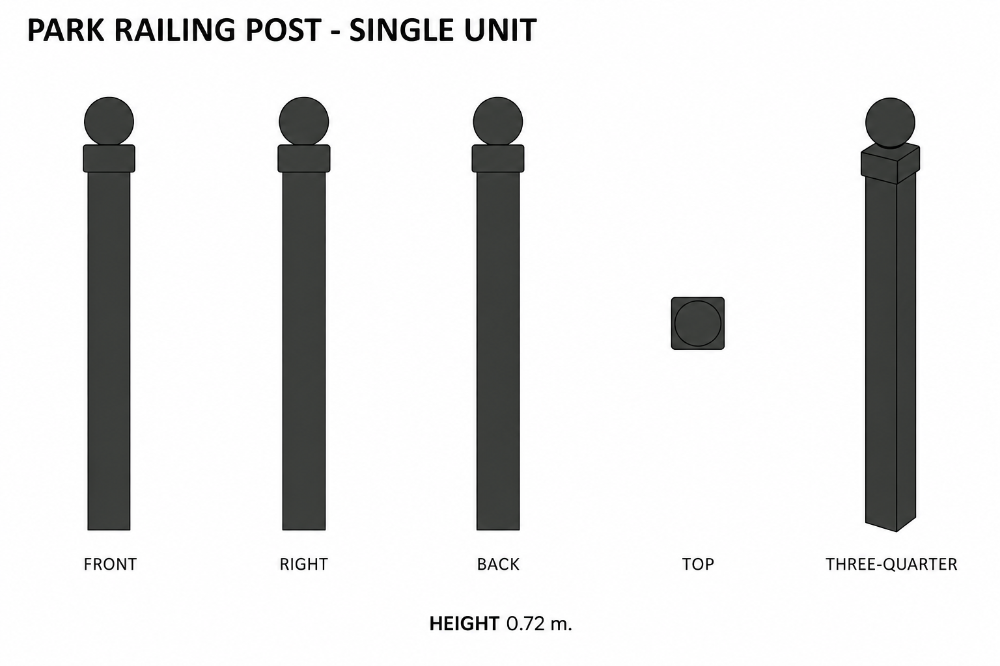
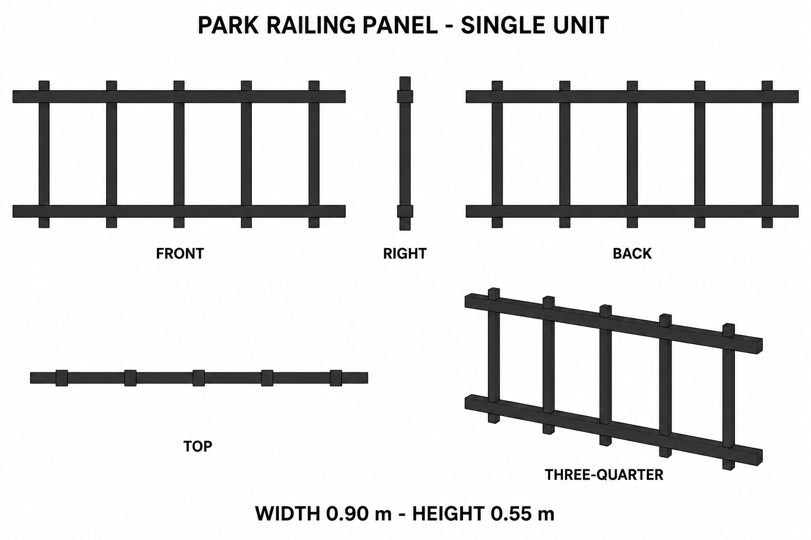

# Group 4M - Park Railing Review

Status: approved for commit by the user. Drawings and specifications only; no model verification.

## One post

## One panel

Review silhouette, colour, independent unit boundaries and suitability for repeated placement. Both sheets show five views. Front/back symmetry, hidden closed ends and numerical proportions are defined in the [geometry supplement](../GEOMETRY-SUPPLEMENT.md) and [JSON](../park-railing-model-spec.json). Generated views are illustrative, not calibrated projections.

The post collar is 0.08 square, larger than its 0.07 spherical finial. The panel contains exactly two rails and five pickets; its final rail centres are Z=0.06 and 0.49. These documented decisions resolve initial prompt and drawing ambiguities.

No shadows or highlights should be reproduced in material textures. See [surface recipes](../SURFACE-RECIPES.md).
