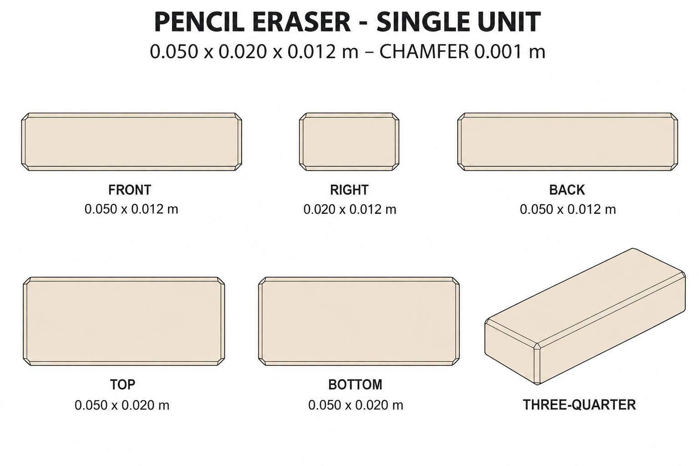

# Group 4AI - Review Gallery

Status: user-approved reference sheets.

## Pencil eraser

One ivory rubber block, 0.050 x 0.020 x 0.012 m, with one-millimetre straight chamfers.

## Review scope

Confirm the plain ivory appearance, chamfered silhouette and single-unit boundary. This is a supplementary design for pencil stationery, distinct from the whiteboard eraser.

- [Geometry and hidden surfaces](../GEOMETRY-SUPPLEMENT.md)
- [Surface recipes](../SURFACE-RECIPES.md)
- [Numeric specification](../pencil-eraser-model-spec.json)
- [Actual prompt](PROMPTS.md)

No wrapper, pencil, paper, ground shadow, model or app implementation is included. Exact dimensions come from the numerical specification; the images are not calibrated projections.
