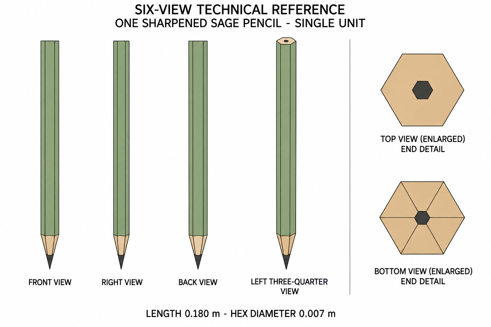

# Group 4AH - Review Gallery

Status: user-approved reference sheets.

## Sharpened sage pencil

One pencil, length 0.180 m and hexagonal corner-to-corner diameter 0.007 m.

## Review scope

Confirm the sage barrel, wood taper, graphite point and one-pencil boundary. End views are enlarged details. The selected revision corrects elevation presentation and removes the extra green borders in the end details.

- [Geometry and hidden surfaces](../GEOMETRY-SUPPLEMENT.md)
- [Surface recipes](../SURFACE-RECIPES.md)
- [Numeric specification](../pencil-model-spec.json)
- [Generation and correction prompts](PROMPTS.md)

This is a supplementary design. No holder, paper, eraser, ground shadow, model or app implementation is included. Numerical geometry defines reconstruction; the images are not calibrated projections.
