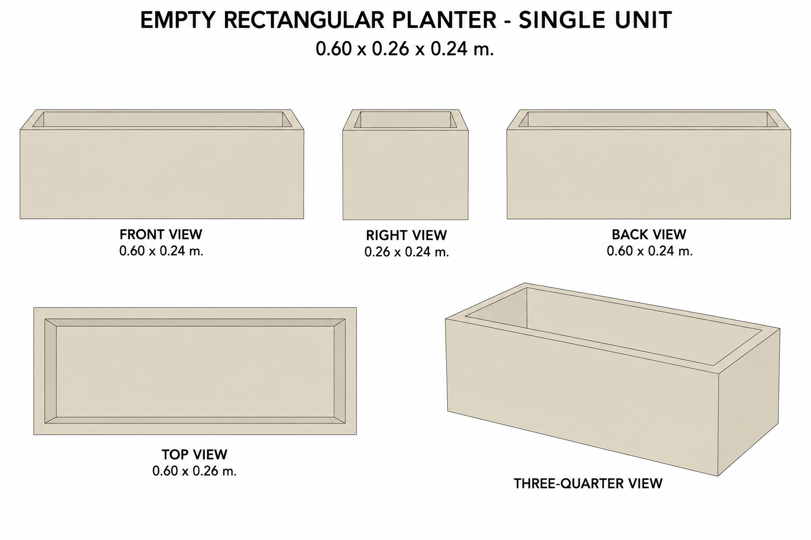
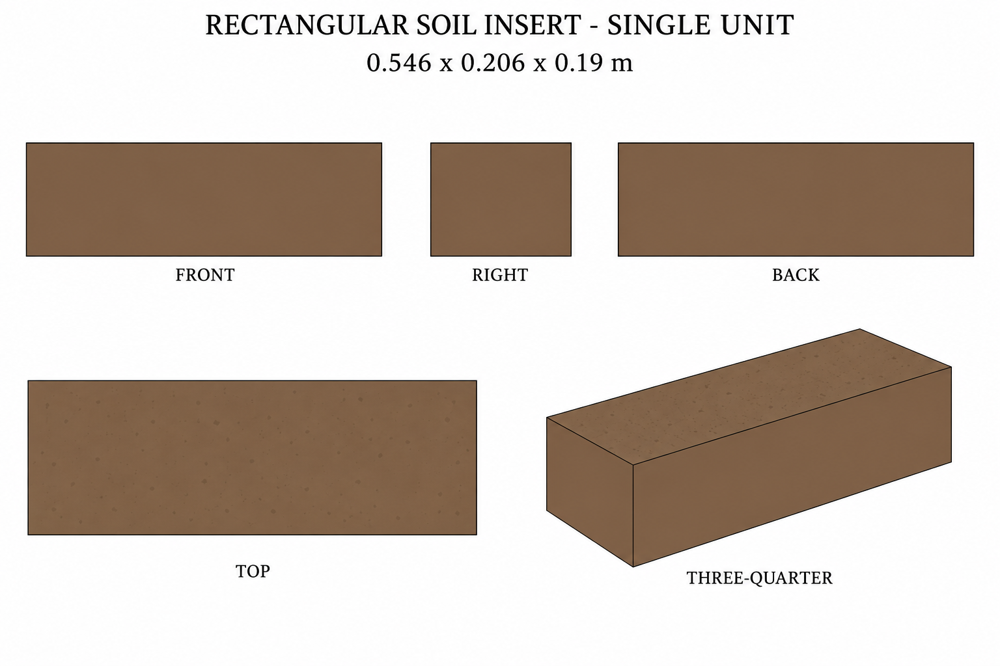

# Group 5F Review - Planter and Soil Insert

Status: user-approved reference sheets.

## Empty rectangular planter

One empty unit, 0.600 x 0.260 x 0.240 m. Square corners, 0.025 m walls and bottom. No plants or soil.

## Rectangular soil insert

One independent volume, 0.546 x 0.206 x 0.190 m. No planter or vegetation. Its dimensions allow 0.002 m side clearance in the matching planter.

## Review scope

These are supplementary designs. Review silhouette, palette, proportions and independent placement boundaries. [Geometry](../GEOMETRY-SUPPLEMENT.md), [numeric specification](../planter-inserts-model-spec.json), and [surface recipes](../SURFACE-RECIPES.md) define hidden surfaces and fit.

No baked lighting, model output or app implementation. Approved for this reference handoff.
