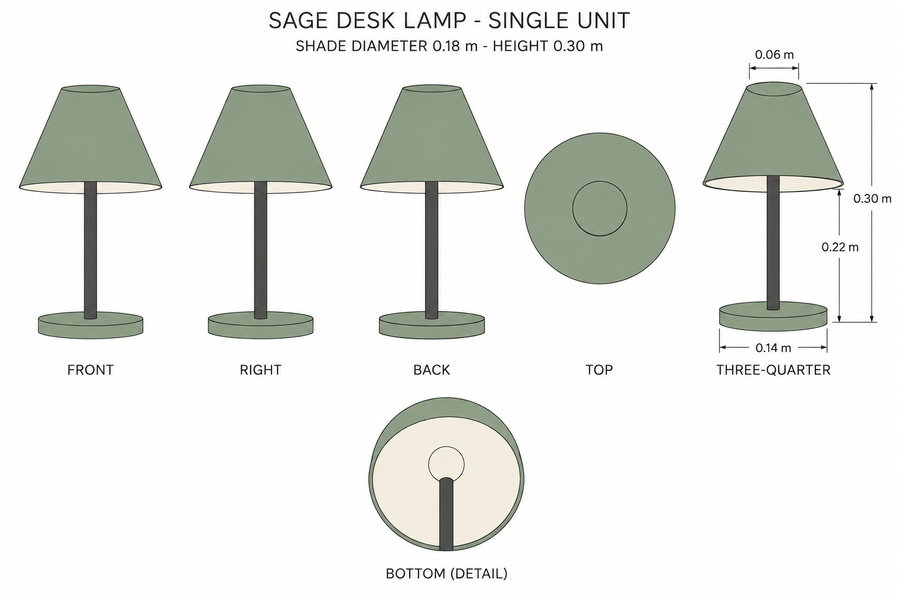
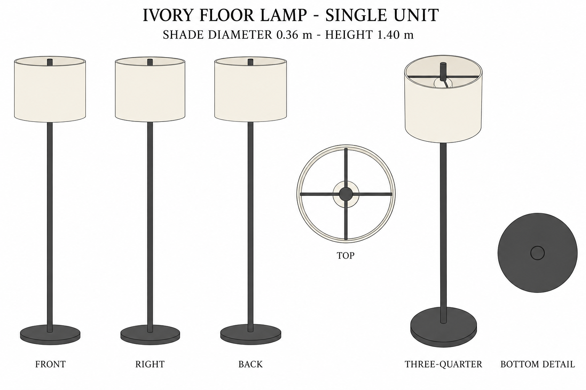

# Group 4Z Review - Desk Lamp and Floor Lamp

Status: user-approved reference sheets.

## Sage desk lamp

One assembly, shade diameter 0.180 m and height 0.300 m. Conical shade with a closed small top and open bottom. Bulb is unlit.

## Ivory floor lamp

One assembly, shade diameter 0.360 m and height 1.400 m. Open cylindrical drum shade, straight stem, crossed upper supports, unlit bulb.

## Review scope

Both are supplementary designs. Review silhouettes, palette, proportions, and visible interior construction. [Geometry](../GEOMETRY-SUPPLEMENT.md), [numeric specification](../portable-lamps-model-spec.json), and [surface recipes](../SURFACE-RECIPES.md) resolve hidden surfaces.

No emitted light, glow, baked shadows, model output, or app implementation. Approved for this reference handoff.

The desk-lamp underside and floor-lamp top insets omit the base for interior visibility. They are explanatory details, not complete assembled projections; refer to the geometry specification for occlusion and part positions.
