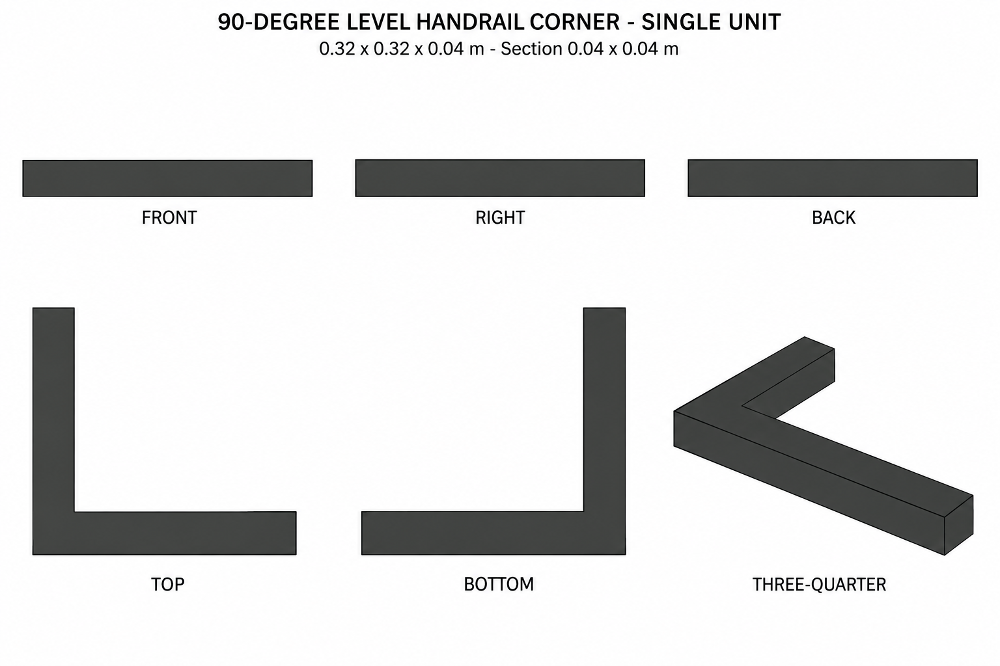

# Group 1G - Review Gallery

Status: user-approved reference sheets.

## 90-degree level handrail corner

One independent solid L-shaped component, 0.32 x 0.32 x 0.04 m overall, with equal arms and a 0.04 x 0.04 section.

## Review scope

Confirm the single-piece L silhouette, square section, charcoal palette and open inner quadrant. Top and bottom show the complete footprint. Perspective is illustrative; numerical geometry defines equal arm lengths.

No post, floor, stair, straight rail extension or ground shadow is included. This is a supplementary design. No model or app implementation is included.

- [Geometry and connection coordinates](../GEOMETRY-SUPPLEMENT.md)
- [Surface recipes](../SURFACE-RECIPES.md)
- [Numeric specification](../railing-corner-model-spec.json)
- [Actual prompt](PROMPTS.md)

Reconstruction and model verification remain a future stage.
