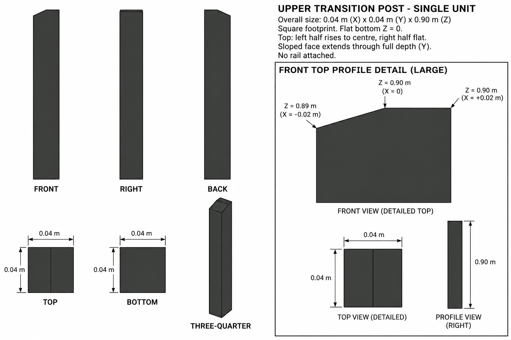
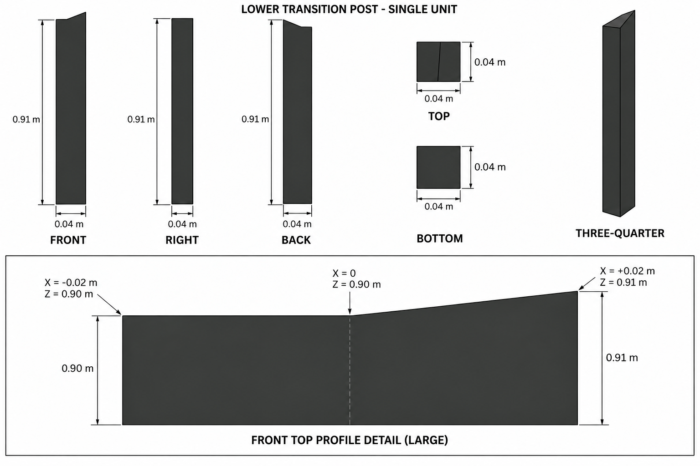

# Group 1F - Review Gallery

Status: user-approved reference sheets. Each sheet represents one independent post.

## Upper transition post

0.04 x 0.04 x 0.90 m. In front view the left top half rises, then the right half is level.

## Lower transition post

0.04 x 0.04 x 0.91 m. In front view the left top half is level, then the right half rises.

## Review scope

Confirm the two distinct top profiles, charcoal palette and single-unit boundaries. Neither asset includes rails, floor or stairs. No ground shadow is included. The lower post's selected revision corrects its full-view top profile to agree with the enlarged detail.

- [Geometry and rail connection coordinates](../GEOMETRY-SUPPLEMENT.md)
- [Surface recipes](../SURFACE-RECIPES.md)
- [Numeric specification](../railing-transitions-model-spec.json)
- [Generation and correction prompts](PROMPTS.md)

These are supplementary designs, not recovered geometry from the original image. Drawings are not calibrated projections; use the documented polygons for reconstruction. No model or app implementation is included.
