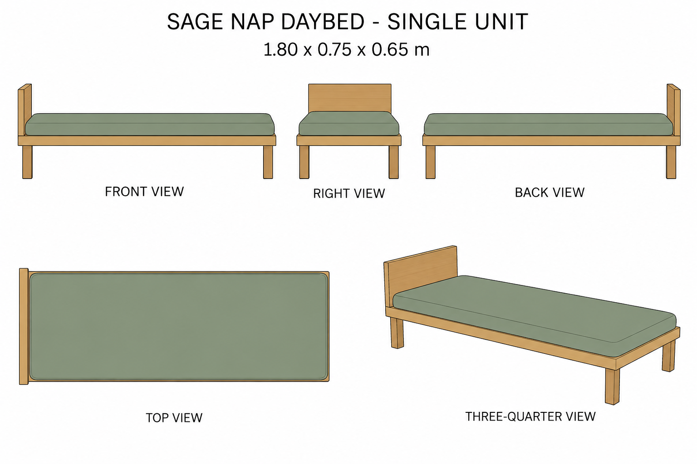
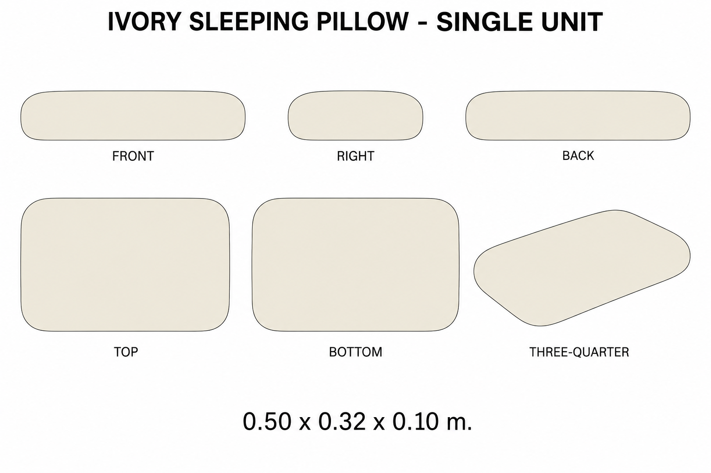

# Group 4AB Review - Nap Daybed and Sleeping Pillow

Status: user-approved reference sheets.

## Sage nap daybed

One independent assembly, 1.800 x 0.750 x 0.650 m. Flat padded surface at 0.420 m, four wooden legs and one headboard. No bundled pillow or blanket.

## Ivory sleeping pillow

One independent unit, 0.500 x 0.320 x 0.100 m. Plain rounded form without seams or wrinkles.

## Review scope

These are supplementary rest-area designs. Review silhouettes, palette, proportions, and separate placement boundaries. [Geometry](../GEOMETRY-SUPPLEMENT.md), [numeric specification](../rest-furniture-model-spec.json), and [surface recipes](../SURFACE-RECIPES.md) define dimensions and hidden surfaces.

No baked lighting, model output, animation or app implementation. Approved for this reference handoff.
