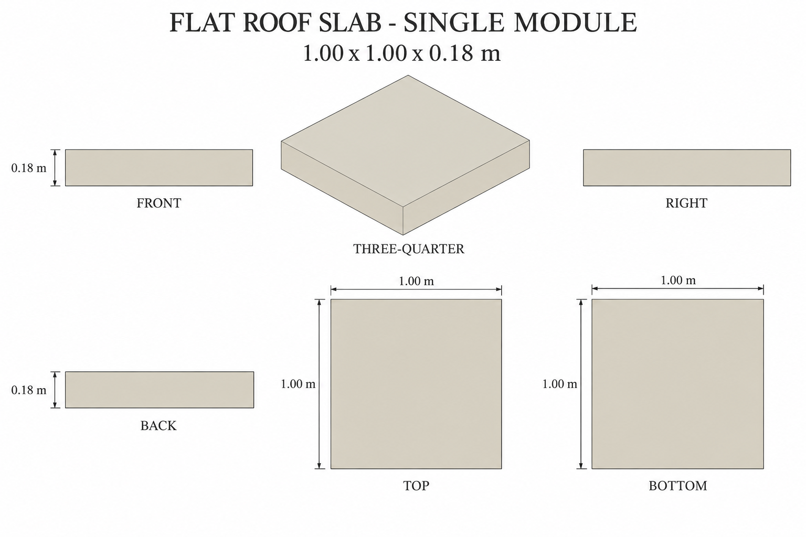
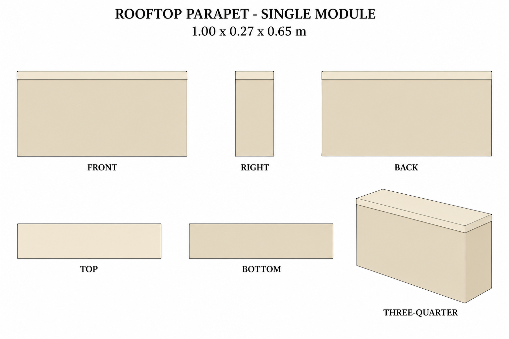

# Group 1B - Review Gallery

Status: user-approved reference sheets. Two independent architectural modules, one unit per sheet.

These are supplementary roof designs in the central office's cream palette. The original cutaway does not show a complete roof to copy. Numerical dimensions and hidden geometry are authored and specified explicitly.

## Flat roof slab

1.00 x 1.00 x 0.18 m. One solid square slab, with flat top and bottom.

## Rooftop parapet

1.00 x 0.27 x 0.65 m. One straight plaster segment including its flush 0.03 m cream cap.

## Review scope

Confirm silhouette, palette and independent-unit boundaries. No ground shadows or surrounding scene are included. These images are appearance sheets, not calibrated CAD views; use the written dimensions for reconstruction. Contours are drawing aids only.

- [Geometry and hidden surfaces](../GEOMETRY-SUPPLEMENT.md)
- [Surface recipes](../SURFACE-RECIPES.md)
- [Numeric specification](../roof-modules-model-spec.json)
- [Actual prompts](PROMPTS.md)

No model, app implementation, animation or Blender verification is included.
