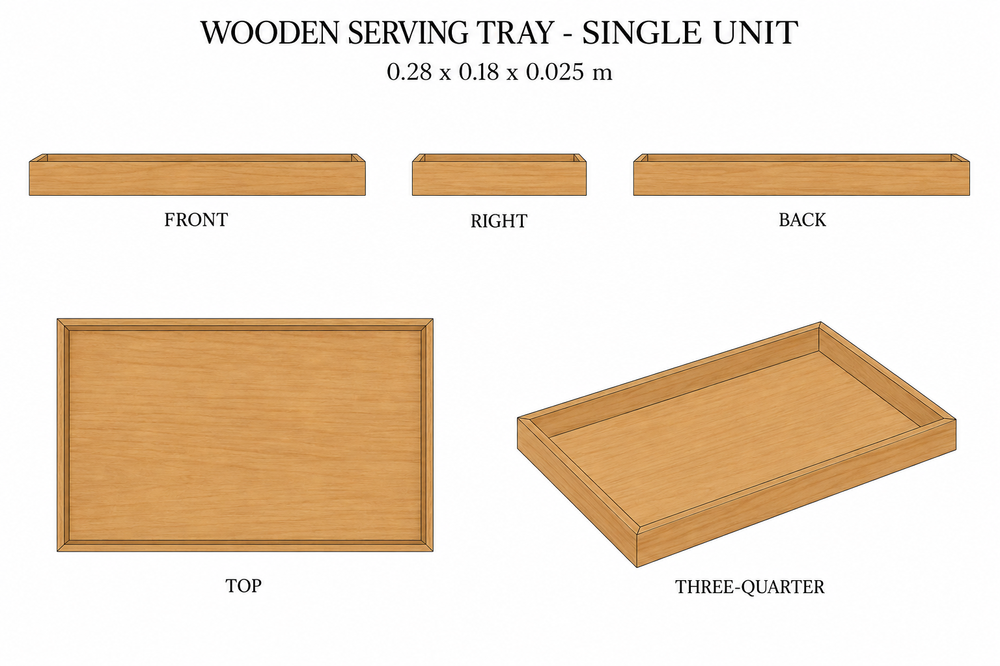
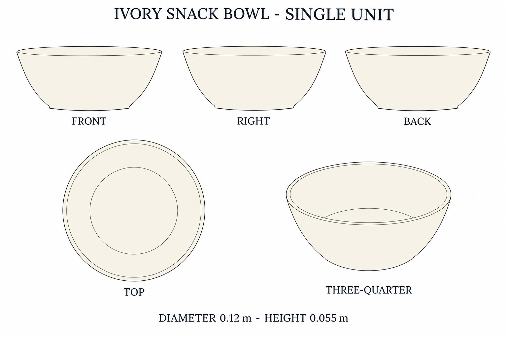

# Group 4R Review - Serving Tray and Snack Bowl

Status: user-approved reference sheets. No model output.

Each sheet describes one independent empty component. Both are supplementary designs matching the established palette, not clearly visible objects recovered from the approved office image. No cast or contact shadows are requested.

## Wooden serving tray

0.280 x 0.180 x 0.025 m. Rectangular perimeter, raised continuous rim, flat underside, no handles.

## Ivory snack bowl

Maximum diameter 0.120 m, height 0.055 m. Open curved bowl, flat bottom, no foot ring.

## Review notes

The generated elevations have a slight downward viewing angle. Use the [geometry supplement](../GEOMETRY-SUPPLEMENT.md) and [numeric specification](../serving-smallware-model-spec.json) for dimensions and hidden geometry. Lines and intrinsic wood grain are not baked shadows. No claims of calibrated projections or validated 3D reconstruction are made.

The user approved the shape, palette, proportions, and supplementary designs for this reference handoff.
