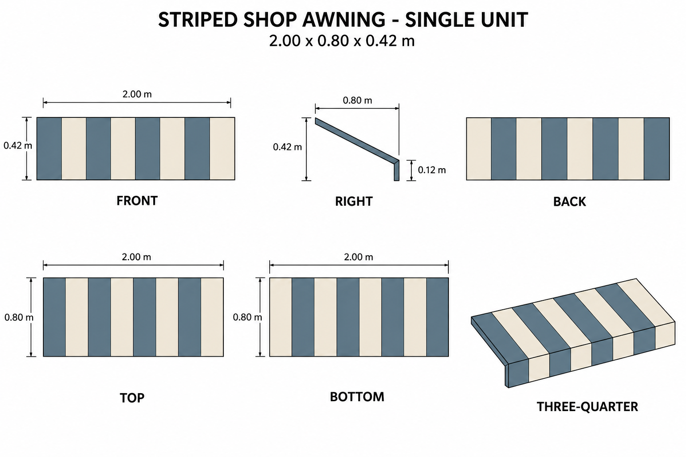

# Group 4AF - Review Gallery

Status: user-approved reference sheets.

## Striped shop awning

One unit, 2.00 x 0.80 x 0.42 m, with eight continuous blue-and-ivory stripes and a straight front valance.

## Review scope

Appearance follows the bookshop canopy in the approved source. Dimensions, stripe count and hidden shell construction are authored. Confirm the sloped form, stripe rhythm and straight valance. The selected revision corrects tapered front/back silhouettes and the initial oblique-view stripe count.

No wall, sign, support structure, shop scene or ground shadow is included. The underside remains open. Front/back drawings simplify internal edge lines; the numeric side profile defines all surfaces.

- [Geometry and hidden surfaces](../GEOMETRY-SUPPLEMENT.md)
- [Surface recipes](../SURFACE-RECIPES.md)
- [Numeric specification](../shop-awning-model-spec.json)
- [Generation and correction prompts](PROMPTS.md)

Drawings are not calibrated projections. No model or app implementation is included.
