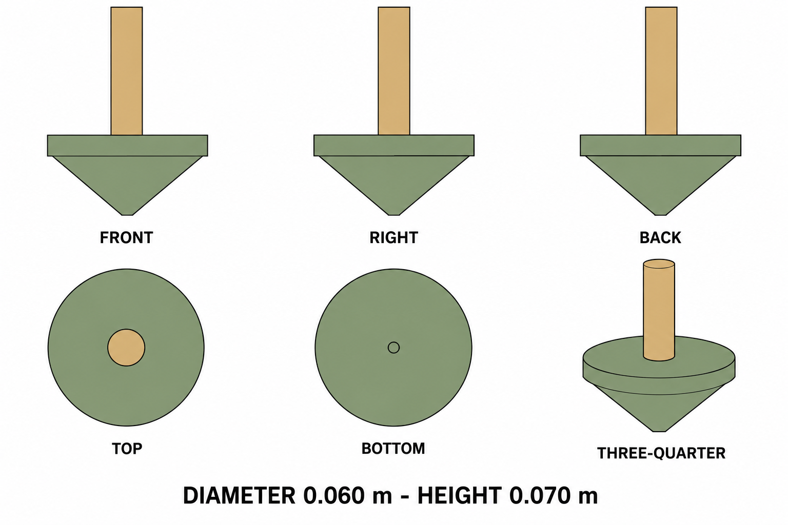

# Group 4AE - Review Gallery

Status: user-approved reference sheets.

## Mini spinning top

One assembled toy, diameter 0.060 m and height 0.070 m. Sage conical body with flat upper annulus and wood-colored handle.

## Review scope

Confirm the simple silhouette, colors and one-toy boundary. The selected revision removes the initial bottom nub and corrects the elevation presentation. No stand, package, scene or ground shadow is included.

- [Geometry and hidden surfaces](../GEOMETRY-SUPPLEMENT.md)
- [Surface recipes](../SURFACE-RECIPES.md)
- [Numeric specification](../spinning-top-model-spec.json)
- [Generation and correction prompts](PROMPTS.md)

This is a supplementary design. Numerical profile dimensions control reconstruction; the drawings are not calibrated projections. No model or animation has been created.
