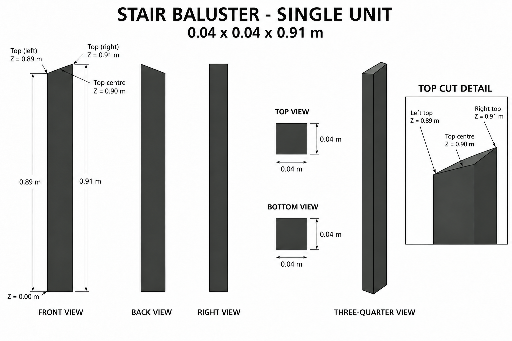
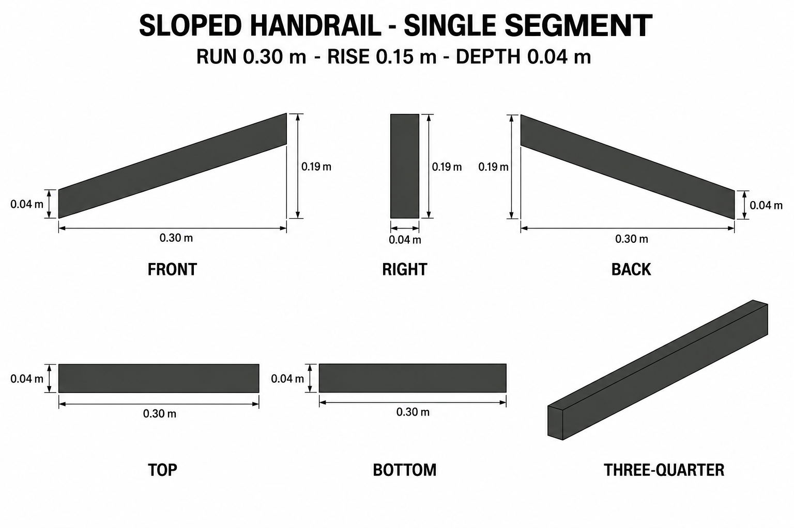

# Group 1D - Review Gallery

Status: user-approved reference sheets. Two independently placeable components.

## Stair baluster

One square post with a sloped top, 0.04 x 0.04 x 0.91 m overall; top centre height 0.90 m. The rear elevation is corrected to reverse the slope in screen space.

## Sloped handrail segment

One segment with 0.30 m run, 0.15 m rise and 0.04 m depth. Vertical thickness is 0.04 m; overall height including rise is 0.19 m.

## Review scope

Confirm independent-unit boundaries, charcoal palette and silhouette. These are supplementary designs following the existing step dimensions and park-railing material. No ground or cast shadows are included.

Sheets are appearance references, not calibrated projections. Written geometry defines exact cuts and hidden surfaces.

- [Geometry and connection reference](../GEOMETRY-SUPPLEMENT.md)
- [Surface recipes](../SURFACE-RECIPES.md)
- [Numeric specification](../stair-railing-model-spec.json)
- [Actual generation and correction prompts](PROMPTS.md)

No models or app changes are included. Model reconstruction and verification remain a later stage.
