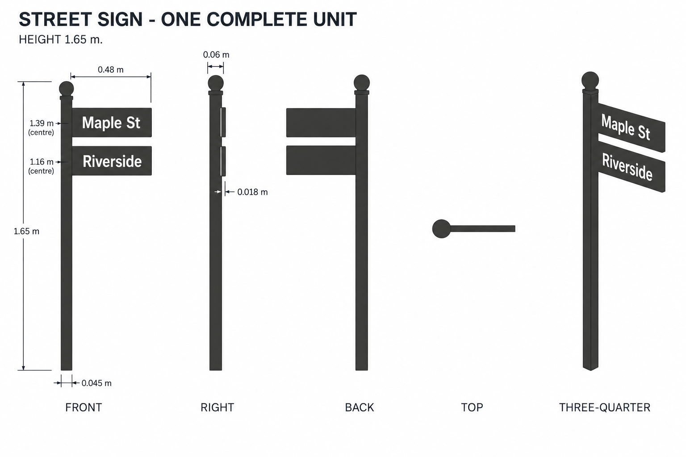
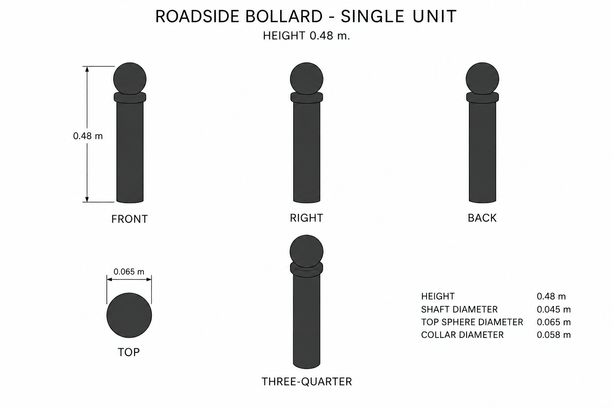

# Group 4N - Street Details Review

Status: approved for commit by the user. Drawings and specifications only; no model verification.

## Complete street sign

## One roadside bollard

Both drawings show front, right, back, top and oblique views. Review appearance and independent unit boundaries. Sign lettering, hidden faces and exact dimensions are defined in the [geometry supplement](../GEOMETRY-SUPPLEMENT.md) and [JSON](../street-details-model-spec.json). The final sign is unbordered; its finial is charcoal. Letter stroke paths are a specified approximation of the illustrative sheet text.

These images are not calibrated projections or production texture maps. No lighting marks should become material features.
