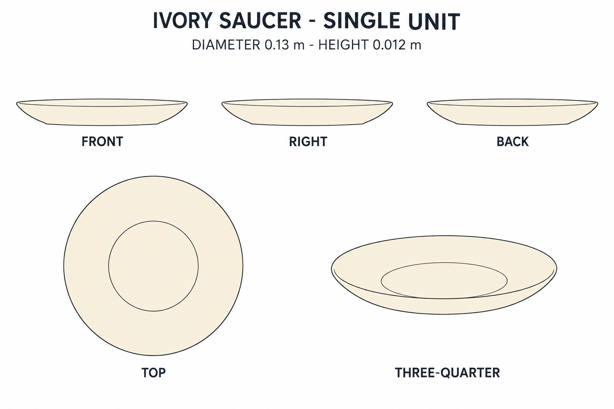
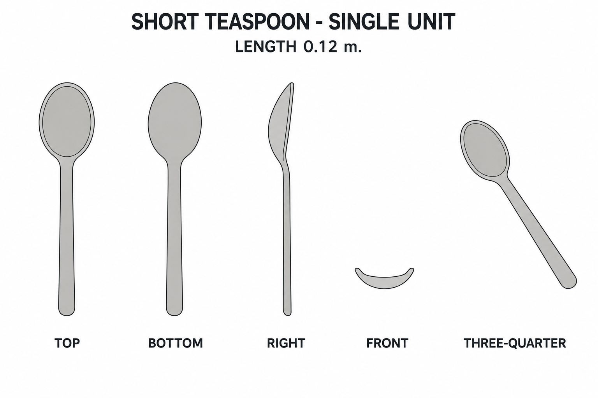

# Group 4P - Tea Smallware Review

Status: approved by the user for commit; no models.

## One ivory saucer

## One short teaspoon

The spoon sheet includes top, bottom, right, front end-on and oblique views to explain its concavity. The saucer uses front, right, back, top and oblique views.

The spoon is an authored addition, not a clearly visible source object. Review its style separately from the source-inspired saucer. Each component is independent; no mug is bundled.

See [geometry](../GEOMETRY-SUPPLEMENT.md), [JSON](../tea-smallware-model-spec.json) and [surfaces](../SURFACE-RECIPES.md). The images are illustrative; the exact surfaces are defined numerically. No drawn contour or illumination should be copied into materials.
