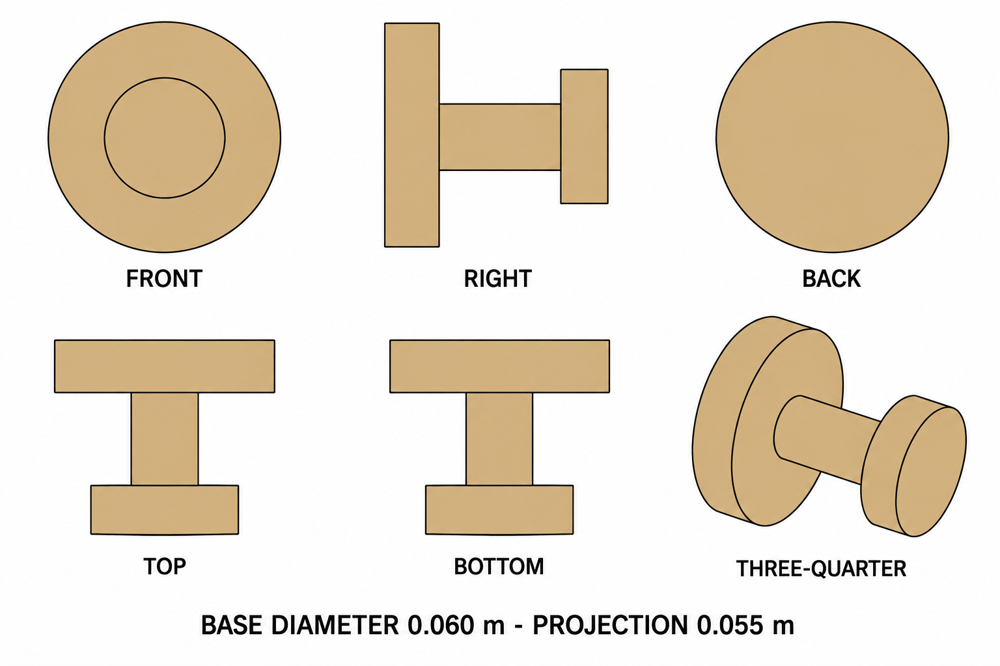

# Group 4AK - Review Gallery

Status: user-approved reference sheets.

## Wooden wall peg

One complete peg, base diameter 0.060 m and total projection 0.055 m.

## Review scope

Confirm the round base, short stem, flat retaining head and single-unit boundary. The selected revision corrects perspective in the side, top and bottom views.

- [Geometry and mounting reference](../GEOMETRY-SUPPLEMENT.md)
- [Surface recipes](../SURFACE-RECIPES.md)
- [Numeric specification](../wall-peg-model-spec.json)
- [Generation and correction prompts](PROMPTS.md)

This is a supplementary design. No wall, clothes, screws, ground shadow, model or app implementation is included. Numerical geometry governs reconstruction.
