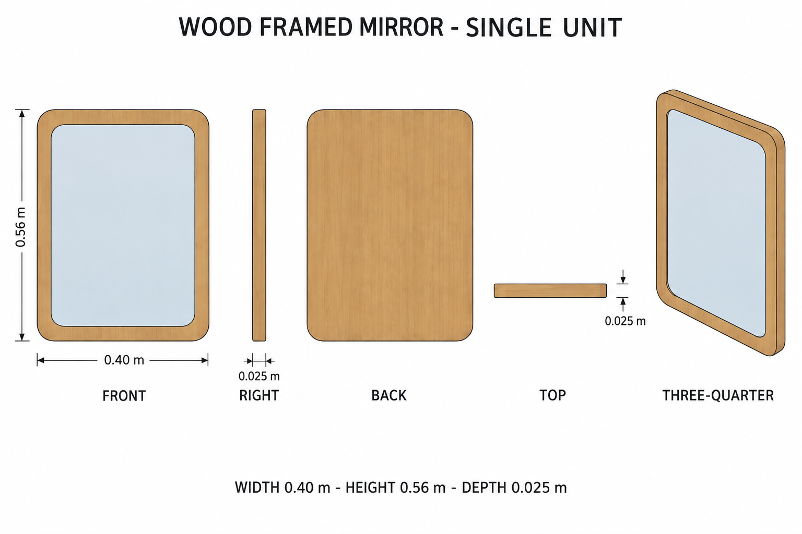
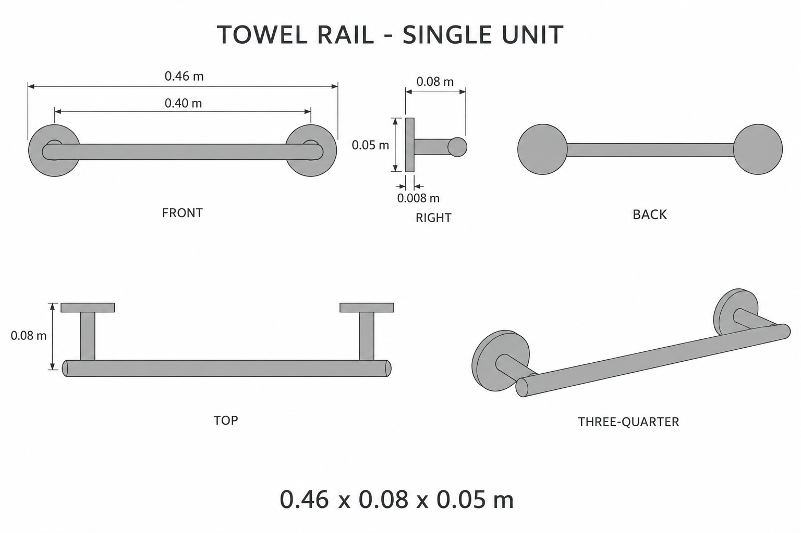

# Group 4T Review - Washroom Accessories

Status: approved for commit by the user. Drawings and specifications only; no model verification.

## Wood-framed mirror

One wall-mounted assembly. Width 0.400 m, height 0.560 m, depth 0.025 m. Honey wood frame, recessed neutral mirror pane, flat wood backing. No painted reflection.

## Towel rail

One empty rail assembly. Width 0.460 m, wall projection 0.080 m, height 0.050 m. One crossbar, two arms, two mounting disks. No attached towel.

## Review boundary

These are supplementary designs, not identifiable original-image objects. Review shape, proportions, color, and independent placement boundaries. Drawings are illustrative; the [geometry supplement](../GEOMETRY-SUPPLEMENT.md) and [numeric specification](../washroom-accessories-model-spec.json) resolve hidden geometry and dimensions.

No baked lighting or reflections. No models, animation, or app implementation. The user authorized committing this reference handoff.
