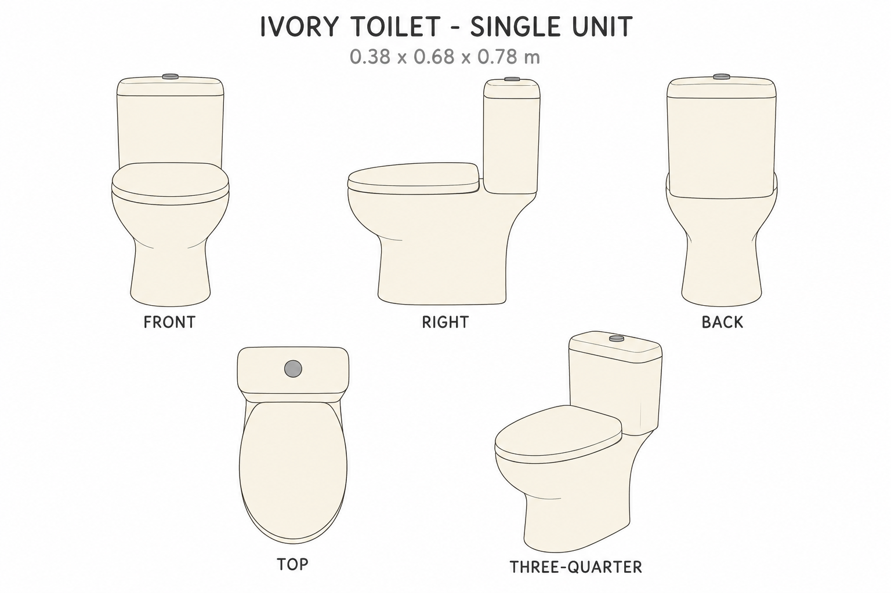
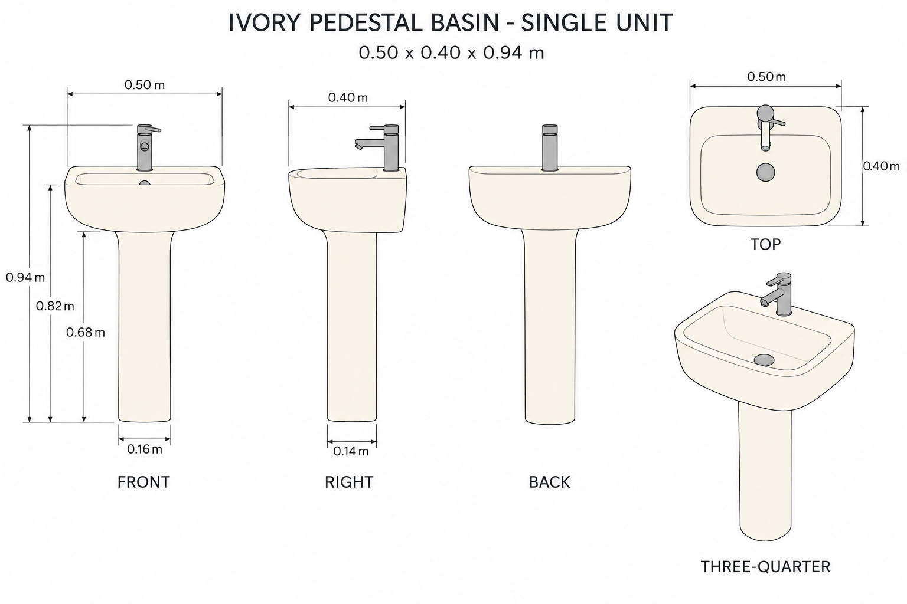

# Group 4S Review - Washroom Fixtures

Status: user-approved reference sheets.

## Ivory toilet

One assembly, 0.380 x 0.680 x 0.780 m. Closed lid in all views. Separate seat, lid, tank cap, and flush button. Hidden cavity and hinge geometry are defined in the handoff, but the open state is not pictured.

## Ivory pedestal washbasin

One assembly, 0.500 x 0.400 x 0.940 m. Basin rim at 0.820 m. Includes faucet and drain disk; no water or room props.

## Review scope

Review the simple ivory style, silhouettes, proportions, and assembly boundaries. The source washroom thumbnail establishes only broad visual cues. Unseen geometry and dimensions are authored. Generated elevations and lever angles are not fully consistent; [numeric geometry](../washroom-fixtures-model-spec.json) fixes the neutral lever direction and dimensions.

[Geometry supplement](../GEOMETRY-SUPPLEMENT.md) and [surface recipes](../SURFACE-RECIPES.md) cover the reconstruction decisions. No baked shadows or lighting maps. These are drawings, not validated 3D models. Approved for this reference handoff.
