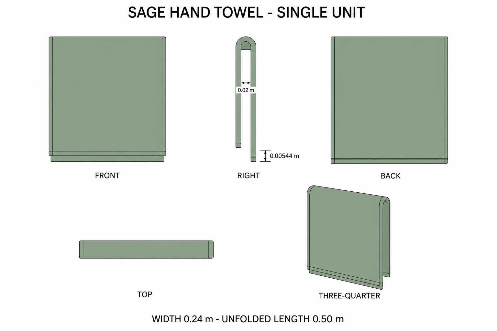
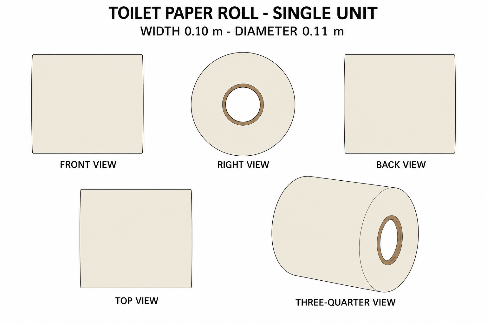

# Group 4U Review - Hand Towel and Paper Roll

Status: user-approved reference sheets.

## Sage hand towel

One continuous cloth unit, 0.240 m wide, 0.500 m unfolded length, 0.002 m thick. Folded over an invisible 0.020 m diameter support; the support is not included.

## Toilet paper roll

One independent roll, width 0.100 m and diameter 0.110 m. Includes paper and cardboard core; no holder or loose sheet. The 0.034 m bore is open.

## Review

Both are supplementary designs matching the established palette. Review silhouette, color, part boundaries and view consistency. The [geometry supplement](../GEOMETRY-SUPPLEMENT.md), [numeric specification](../washroom-linen-model-spec.json), and [surface recipes](../SURFACE-RECIPES.md) define hidden structure.

No baked shadows, models or app implementation. Approved for this reference handoff.
