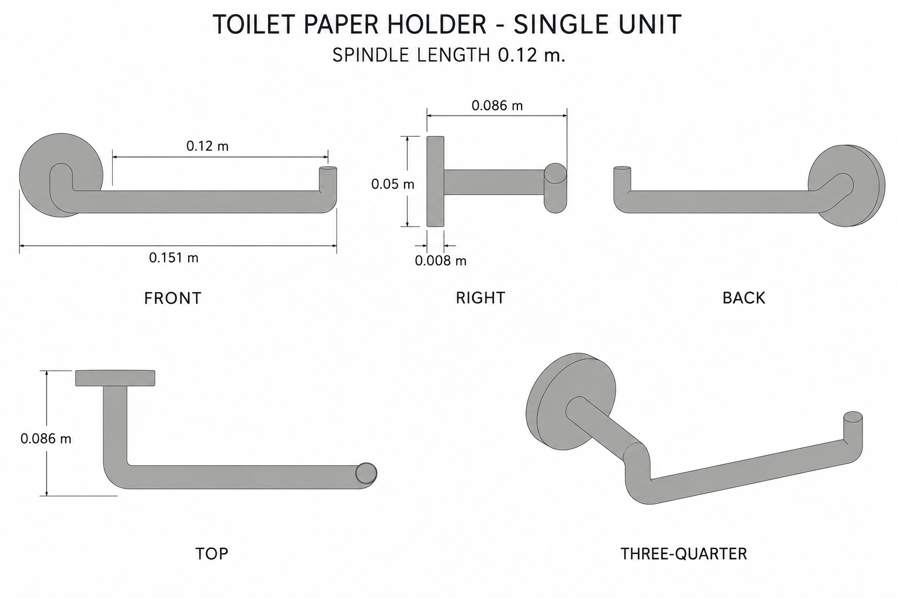
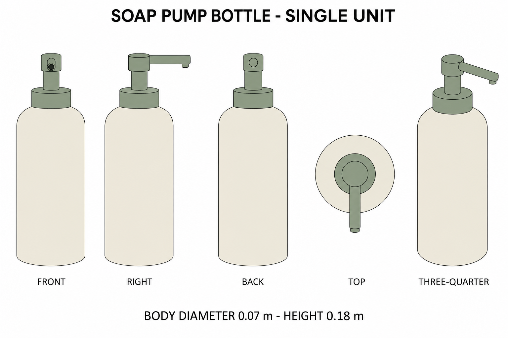

# Group 4V Review - Paper Holder and Soap Bottle

Status: user-approved reference sheets.

## Empty paper holder

One wall-mounted unit: one disk, one bent rod, one retaining tip at the rod end. No roll or wall included. Spindle centerline reaches 0.120 m horizontally.

## Soap pump bottle

One independent ivory bottle with sage pump, body diameter 0.070 m and total height 0.180 m. No liquid, label, or attached furniture.

## Handoff

Review silhouette, color, unit boundaries, and view consistency. These are authored companion objects, not source-image reconstructions. [Geometry](../GEOMETRY-SUPPLEMENT.md), [numeric specification](../washroom-utilities-model-spec.json), and [surface recipes](../SURFACE-RECIPES.md) resolve dimensions and hidden construction.

No baked lighting, model output, or app implementation. Approved for this reference handoff.
