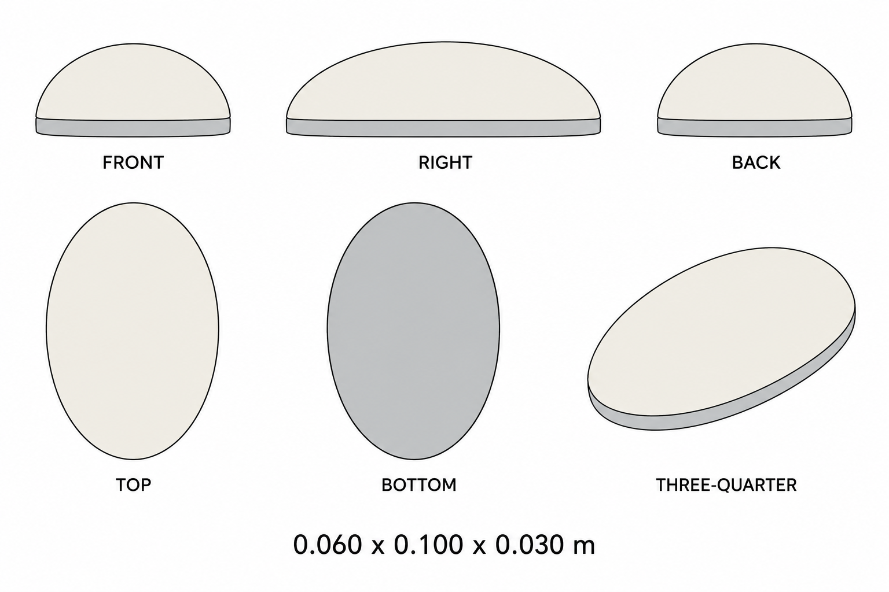

# Group 4AJ - Review Gallery

Status: user-approved-reference sheets.

## Minimal wireless mouse

One simplified mouse, 0.060 x 0.100 x 0.030 m. Warm-white curved shell with a thin gray base.

## Review scope

Confirm the simple oval form, two-color body and single-unit boundary. The underside is intentionally plain. There is no cable, pad, logo, wheel or ground shadow.

- [Geometry and hidden underside](../GEOMETRY-SUPPLEMENT.md)
- [Surface recipes](../SURFACE-RECIPES.md)
- [Numeric specification](../wireless-mouse-model-spec.json)
- [Actual prompt](PROMPTS.md)

This is a supplementary design. Use numerical surfaces for reconstruction; the views are not calibrated projections. No model or app implementation is included.
