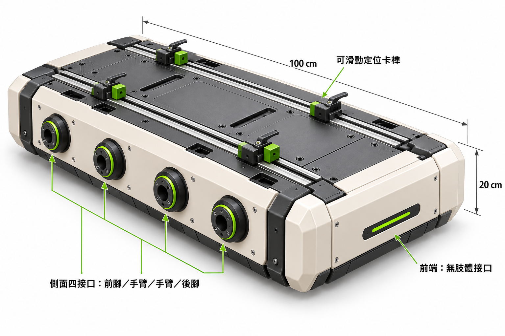
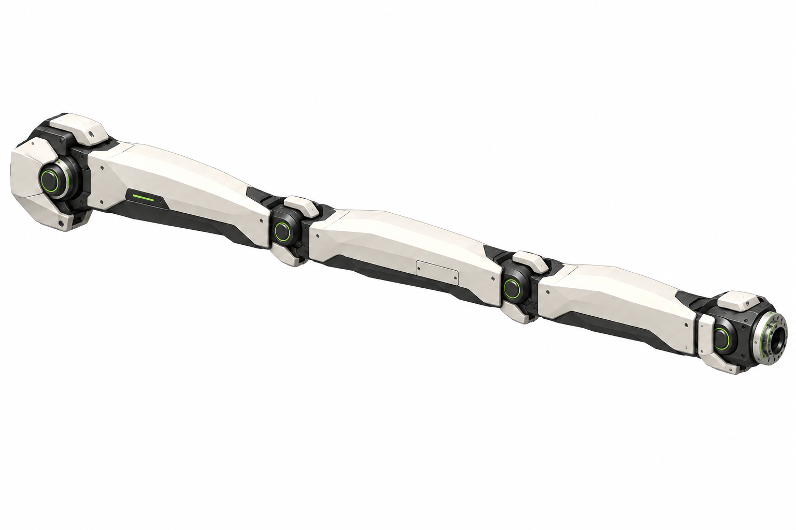
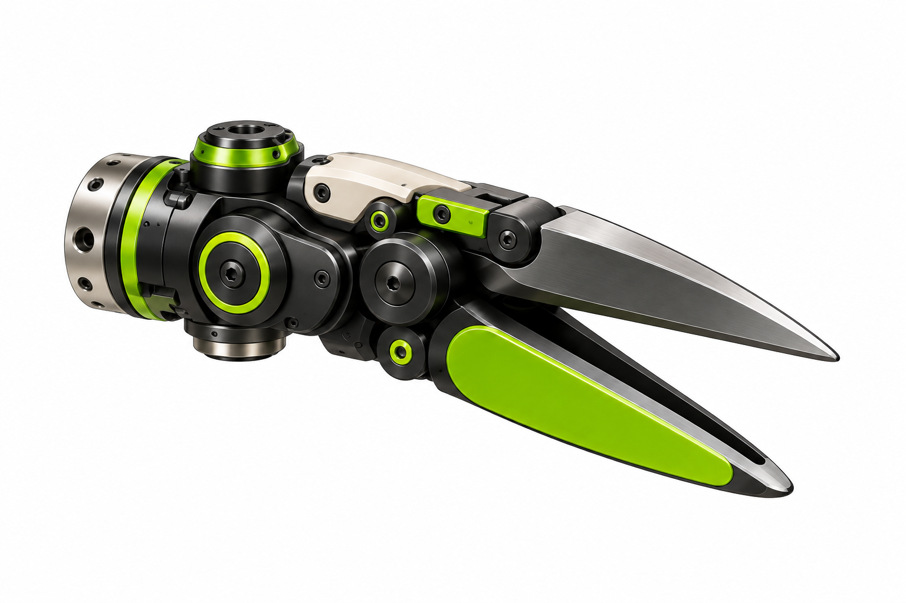
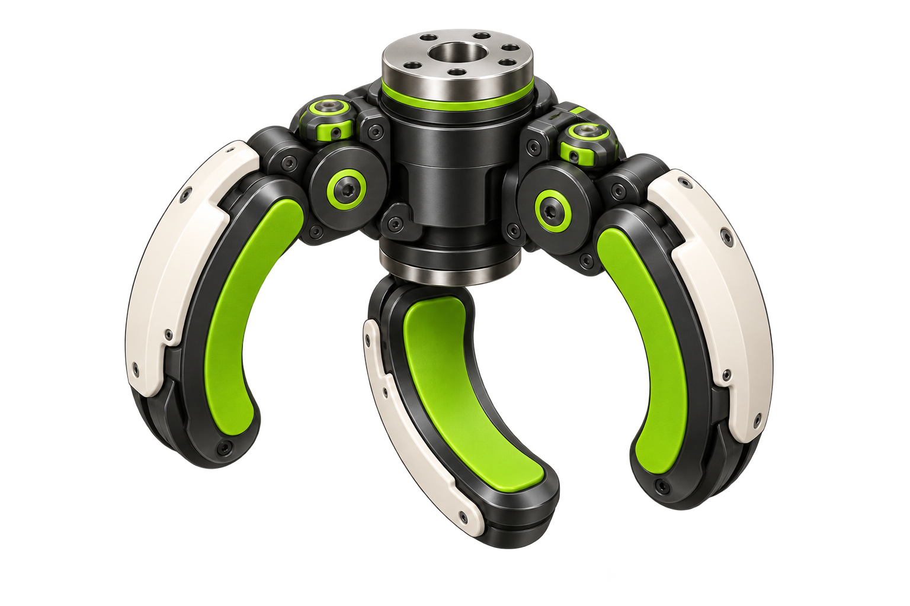
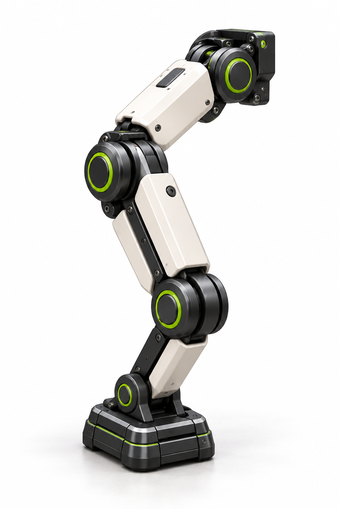

# FieldScope robot component visual references

These five images preserve the selected component appearance references from
the robot design discussion. The leg image is the exact replacement supplied
and identified by the user on 2026-09-18. They are visual references, not
dimensioned manufacturing drawings or proof of mechanical feasibility. This
collection does not change the simulation rig, hardware specification, or app
behavior.

| Image | Selected scope | Interpretation boundary |
| --- | --- | --- |
| [Chassis](01-chassis.png) | Body envelope: length 100 cm, width 60 cm, height 20 cm; front points toward the lower right. Four interfaces on each long side; no limb interfaces on front/rear end faces. | Use this version rather than the later rejected socket redistribution. Top manual clamps are superseded and are not selected hardware. The grouped interface caption does not determine front/rear orientation. |
| [Three-link arm](02-three-link-arm.png) | Three shaped arm links, compact inset joints, independent wrist; arm length target 120 cm excluding the end tool. | The thin four-hole mounting plate is omitted. The final chassis attachment, joint travel and load capacity remain unverified. |
| [Scissors](03-scissors.png) | Cutting end tool appearance. | Geometry, actuation and cutting performance remain to be engineered. |
| [Enveloping gripper](04-enveloping-gripper.png) | Three curved fingers with green compliant contact pads. | Contact force, fruit-size range and damage prevention are not established by the image. |
| [Leg and foot](05-leg-and-foot.png) | The isolated leg and foot explicitly identified by the user as the correct reference on 2026-09-18. | This replaces the previously cited discarded full-robot image as the visual reference. Do not infer validated joint axes, travel or dimensions from this illustration. |

## Chassis

## Three-link arm

## Scissors

## Enveloping gripper

## Leg and foot

## Excluded drafts

Discarded full-robot composites and the socket-redistribution image are not part
of this collection. Automatic crate-stop illustrations are also excluded: their
proportions and motion directions still need correction. The discussed 15 cm
stop height and adjustable crate-opening proposals do not make those draft
images validated mechanisms.
